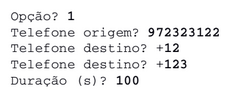

## **Programming** Fundamentals, ExtraX

### Extra Exercises

###### this is an adaptation of the practical guide provided by Professor João Manuel de Oliveira e Silva Rodrigues

#### Exercises

1. A telecommunications company needs a program to record and bill phone calls made by its clients. Each phone call has an origin and a destiny phone numbers, and a duration (in seconds).
   a) The program must present a menu and process each chosen option.

   
   b) Write a function to validate a phone number. A valid phone number is a string with at least 3 digits (0-9), optionally with a '+' symbol in the beginning. Any other character is forbidden.
   c) Add the option to register a new call (from the keyboard). Use the previous function in order to validate the origin and destiny phone numbers.

   
   d) Develop an option to read a file of calls. In the file, each call is registered with 3 "words" separated by white spaces: the first one is the origin number, the second one is the destiny number and the last one is the duration in seconds. You can use the available files to test. There's no need to validate the data in the files. 

   
   e) The "List Clients" option should show an **ordered** list of the clients who made calls. This is, it must list all **origin numbers** of the calls, **without repetitions**.   

   
   f) Develop an option to produce a detailed invoice. It should ask the client number and list all the calls made, their duration and cost, as well as the total cost. The cost of a call is calculated based on the following price table:

   | Destiny                                         | Cost per minute |
   | ----------------------------------------------- | --------------- |
   | Land line (numbers starting by "2")             | 0.02€           |
   | International (numbers starting by "+")         | 0.80€           |
   | To the same network (the same first two digits) | 0.04€           |
   | Others                                          | 0.10€           |

   

2. Jackpot is a social game in which players fill in a bulletin with a bet for each football match (1- host team's victory, X - tie, 2 - visitor's victory). Create an application which allows the users to play a simplified version of the Jackpot. In this version, the player should fill in a bulletin with a set of 9 bets from that championship tournament. 
   a) It is provided a file with the list of tournaments and all its games. Each line indicates the tournament, the host team and the visiting team of a game. Create an interface with the player (better) that registers the bets to each tournament game. The user introduces the tournament number and then the bet to each game asked by the program. The program must then validate the tournament's number (it has to be in the **[Jornadas.txt](https://github.com/alexandradecarvalho/programming-fundamentals/blob/main/practical-classes/extrax/Jornadas.txt)** file) and each bet (only 1,X,2 allowed). At the end, you should store a file with the name of the tournament (example: `tournament1.csv`) with all bets made, one per line. Each line should have the number of the game and the bet (1,X,2).
   b) It is also provided a file with games' results of the portuguese league from 2014-15. Each line has information from a game: date, host team, visiting team, host team's goals, visiting team's goals. Now, alter the program so that, immediately after a player has filled its bulletin, presents a table with games from that tournament, its results, bets, and indicate which were right/wrong.
   c) At the end of the table, indicate the number of right bets and if the player got the first prize (all bets right), the second prize (8 bets right), the third prize (7 bets right), or if they don't get a prize.
   d) Repeat the game until the user answers zero to the "Tournament? " question. Since each bulletin costs 0.40 euros, the first prize is 5000€, the second prize 1000€ and the third prize 100€, calculate the balance of the player at the end of each bulletin. The initial balance is 0, so if a player fills in a bulletin they're automatically at a negative balance of -0.40€.
   e) Add the possibility of multiple bets. In that case, the user can introduce a double (1X,X2,12) or triple (1X2) bet in each game. After reading a bulletin with multiple bets, calculate the equivalent number of bets and its cost (each bulletin at 0.40 euros). Notice that, for each double bet, the equivalent number of bets doubles, and for each triple bet, it triples. 

3. Lets recreate a cash register from a supermarket. The register has a database (text file) with the product code, product name, product section, price and taxes. The program should repeat a menu with the available options: I -insert items; F- invoice; S - exit.
   a) In the "insert items" option, the program should ask for the product code and calculate the final price, printing something in the screen such as:

   > Rice: 1.23€

   The input must be repeated until the user inserts the special code zero. Items that aren't in the database should be ignored.

   b) When the user choses to leave, the program should record, in a file, all the products sold. Each line should represent a different client and should record time of purchase (use `time.strftime("%d/%m/%Y %H:%M")`) and the total value.

   c) When the user choses to leave, the program should record, in another file, the sold stock. Each line should have the product code and the total number of sold items.

   d) When the user asks for the invoice, the program should print one with all products organized by section and sorted by name. 

4. We wish to make a histogram of the top 10 most mentioned words in Twitter, in a given period of time. To do so, it is provided a **[twitter.json](https://github.com/alexandradecarvalho/programming-fundamentals/blob/main/practical-classes/extrax/twitter.json)** file which has a list of 895 tweets in JSON format. The **[twitter.py](https://github.com/alexandradecarvalho/programming-fundamentals/blob/main/practical-classes/extrax/twitter.py)** program already has some instructions to read that file and show some of the read data. Analyse it and change it in order to resolve this exercise.

   a) Create a list of all mentioned words ('text').

   b) Sort that list by number of times the word is mentioned (you can use Python's sorting methods).

   c) Create a new list sorted by the hashtags (words starting with "#").

   d) Create a histogram with maximum score 18 for the most popular hashtags. Example:

     

