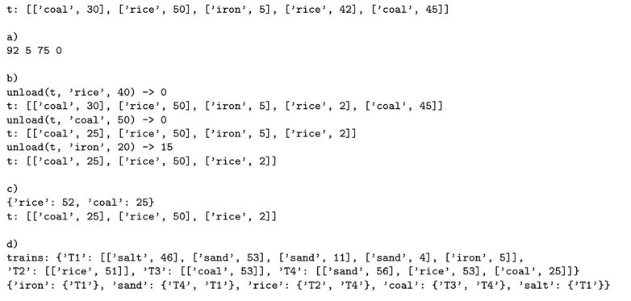

## **Programming** Fundamentals, ExtraY

### Training Exercises

###### this is an adaptation of the practical guide provided by Professor João Manuel de Oliveira e Silva Rodrigues

#### Exercises

1. The [**stocks.py**](https://github.com/alexandradecarvalho/programming-fundamentals/blob/main/practical-classes/extraY/Jornadas.txt) program defines a list of tuples with data on several companies' stocks, transacted in many cities' markets. Each tuple has: company name, city, opening price, closing price and volume. The program has many instructions to test each task.
   a) Alter the `printStocks` function to show the table with aligned and formatted columns, as seen on the example below. Add an extra column with the valuation of the stock, in percentage. For example, if the opening price is 10.00 and the closing price is 9.50, the valuation will be -5%. Notice that this function should not modify the given list.
   
   > INTC	London		34.25		34.45 		1792860 	0.6%
   > TSLA	London    	221.33  	229.63   	398520 	  3.8%
   > EA		Paris	 		72.63    	68.98 		1189510 	-5.0%
   > INTC	Tokyo 	  	33.22    	34.29 		4509110 	3.2%
   > TSLA	Paris 			217.35  	217.75  	252500 	   0.2%
   > ATML   Frankfurt 	8.23 	 	8.36 	  	810440 	   1.6%

b) Add the right arguments to the sorted function in order to get an ordered table by the company name and, for the same company, by decreasing transacted volume.

c) Alter the program to add to `stocks3` a list only with the stocks from the Paris market. **Hint:** you can use a *comprehension list*.

d) The **[stocks.txt](https://github.com/alexandradecarvalho/programming-fundamentals/blob/main/practical-classes/extraY/stocks.txt)** file has information on more stocks. Each line represents a stock, with its fields separated by TABs. Create a `load` function to read the file and return a list of tuples of the same type as the `stocks` variable. The instructions after the function call should execute without errors.

2. The number of combinations without reposition of n objects k-a-k, where k <= n, can be obtained by: `A(n,k) = 1 if k = 0;  n*A(n-1,k-1)  if 0<k<=n`. Implement this function in the **[arranjos.py](https://github.com/alexandradecarvalho/programming-fundamentals/blob/main/practical-classes/extraY/arranjos.py)** program and test it, calling it with some n and k values, such as A(2,1) = 2; A(5,2) = 20; A(5,3) = 60; A(10,3) = 720.
3. The **[trains.py](https://github.com/alexandradecarvalho/programming-fundamentals/blob/main/practical-classes/extraY/trains.py)** program allows the management of product trains. Each train is represented by a list of wagons and each wagon is a list with two elements that indicate the type and quantity of produce. For example: t = [['coal',30], ['rice',50], ['iron',5], ['rice',42], ['coal',45]] represents a train with 5 wagons: the first wagon with 30 tons of coal, the second with 50 tons of rice, etc. The program already has a `main` function, which creates several trains and calls many functions. Complete these function so that the program works correctly.

a) The `quantityOf(t,m)` should return the total quantity of products of type `m` in a given `t` train.

b) The `unload(t,m,q)` function should unload from a train `t` a quantity `q` of produce of type `m`. In order to do so, it should go through each wagon and, from the last one, unload totally or partially the wagons that have the wanted product, until the unloaded quantity suffices. The totally unloaded wagons should be taken off the train, but the rest of them must remain in the original order. If you can unload the wanted quantity, the function must terminate and return zero. Otherwise, it should return the missing quantity. 

c) The `d = merchandise(t)` function must return a dictionary `d` with the total quantity of products of each type in train `t`, which must not be altered.

d) The main function defines a dictionary named `trains` which associates names to trains (lists of wagons). Complete the `trainsPerMerchandise(trains)` function to create a dictionary that, to each type of product, associates the names of the trains that transport them, without repetitions. The result should be the following:

