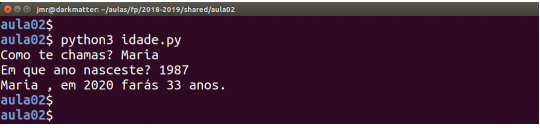

## Class 02 - RESOLVED

### The Python language

###### this is an adaptation of the practical guide provided by Professor João Manuel de Oliveira e Silva Rodrigues

#### Exercises

1. Write a program that reads a value1 of temperature in Celsius degrees, converts it into Fahrenheit degrees and prints the result in the form of "X oC = Y oF". The formula to convert Celsius degrees (C) into Fahrenheit (F) is F = 1.8*C + 32.

2. A car travels between two cities with an average speed of v1 and returns through the same path with an average speed of v2. Write a program that asks both values, v1 and v2, and calculates and prints the average speed of the whole trip. Notice that the average speed is given by the division between the distance and the time taken, v=d/t. Analyse and calculate one or two examples on paper before writing the program. The solution is not as obvious as it looks!

3. Notice the following example of interaction with a Python program. The text after the question marks has been introduced by the user. Can you write a similar program?

  

  

4. Write a program in which, given a time in seconds, shows in the console the time with the format hh:mm:ss. Notice that in Python, the operators // and % calculate the quotient and the remainder of the division. You must use `print("{:02d}:{:02d}:{:02d}".format(h, m, s))` to format the result.

5. In a building with 4 floors (including the ground-level floor) and a tenant by floor, the elevator goes up and down 2 times a day per tenant. If every floor has a height of 3m, how many km the elevator does in a year? Considering that the elevator travels at a constant speed of 1m/s, how many hours does this elevator work in a year?

6. A rectangle triangle has legs A and B and hypotenuse C. Write a program that reads the length of the legs and determines the hypotenuse, as well as the angle (in degrees) between leg A and the hypotenuse. We suggest you use the `math` module.

7. The program [**points.py**](https://github.com/alexandradecarvalho/programming-fundamentals/blob/main/practical-classes/lab02/points.py) reads the Cartesian coordinates of two points (x1,y1) and (x2,y2). Complete it to calculate and print the distance between the points.
8. A book costs 20€ to make (PF). Suppose that the cover price of a book is 24,95€ (PC) and that it pays a tax of 23% (IMP). It adds to the value of the book a tax to reward the authors for each copy, of 0,20€ (SPA). `PC = (PF + Profit) * (100% + IMP) + SPA`. For 500 copies, how much would be the book store profit? How much has been collected in taxes? 
9. If one leaves the house at 6:52 and goes 1 km walking (at the pace of 10 min per km), and then do a quick training of 3 km (at 6 min per km) and goes back home walking, at what time do they arrive home for breakfast?
