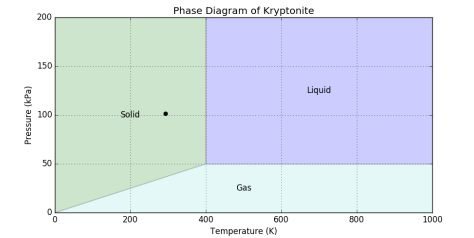

## **Programming** Fundamentals, Class 03

### Conditional Instructions

###### this is an adaptation of the practical guide provided by Professor João Manuel de Oliveira e Silva Rodrigues

#### Exercises

1. The **[max2.py](https://github.com/alexandradecarvalho/programming-fundamentals/blob/main/practical-classes/lab03/max2.py)** program reads two numbers and shows the biggest one. Test it and analyse it. Alter the program to the same as it already does, but using a conditional instruction instead of the pre-defined max function.
2. Copy the previous program and modify this copy to find the biggest out of three numbers. Use conditional instructions. Can you do it with only two comparisons?
3. Write a program that reads an integer and shows a message indicating whether the number is even or odd. Hint: use the operator % to get the remainder of the division by 2.

4. Create a program that asks the number of fuel litres of a supply and determines the price to pay. Consider that the fuel costs 1,40€ per litre and that supplies of over 40 litres have a 10% discount.

5. Execute the **[age.py](https://github.com/alexandradecarvalho/programming-fundamentals/blob/main/practical-classes/lab03/age.py)** program and test it with several input values. Analyse the source code to understand how it works. Can you detect the semantic error? Which age values produce the "adult" category? Fix the bug. Can you re-write the code with an `if-elif-else` instruction? Try to simplify the code to eliminate redundant conditions.

6. The body mass index (BMI) is a measuring unit, used to evaluate whether or not a person has their ideal weight for their height. The **[imc.py](https://github.com/alexandradecarvalho/programming-fundamentals/blob/main/practical-classes/lab03/imc.py)** program determines the BMI of the user and classifies it into just two categories. Try the program and analyse it. Modify it to return one out of 4 categories according to the table below. Avoid testing redundant conditions in the program.

   | BMI (kg/m2):  | <18.5  | [18.5, 25[ | [25, 30[ | 30 ou mais |
   | ------------- | ------ | ---------- | -------- | ---------- |
   | **Category:** | Skinny | Healthy    | Strong   | Obese      |

   

7. The stages' diagram of Kryptonite (fictional substance) is very unusual (just look at the figure below). It tells us that under normal conditions of temperature and pressure (the black dot), Kryptonite is solid, but if the temperature is above 400 Kelvin and the pressure is above 50 kPa, it turns into liquid. It can also turn into gas if the pressure is low and the temperature high enough.

   

   The [**kryptonite.py**](https://github.com/alexandradecarvalho/programming-fundamentals/blob/main/practical-classes/lab03/kryptonite.py)  program should ask the temperature and pressure and return the correspondent stage, but it has many bugs.

   a) Execute `python3 kryptonite.py` and see the syntactic error reported. Detect it and fix it. **Hint**: beware of the brackets.

   b) Execute it again. Is there a TypeError? Why? Fix it.

   c) Now you should be able to execute the program, but it still has some semantic errors. For example, at 300K e 100kPa, the stage should be SOLID. Modify the conditional instructions to determine the stage correctly. **Hint**: start by determining the equations of the lines which divide the space.

   d) Adjust the result's string so that the temperature shows up with 1 decimal place and the pressure with 3. **Hint**: use the `str.format`  method. You have some examples in [**examplesformat.py**](https://github.com/alexandradecarvalho/programming-fundamentals/blob/main/practical-classes/lab03/examplesformat.py).

8. Write a program that asks for the grades of two evaluation components, CTP and CP, and calculates the final grade (integer) of a Programming Fundamentals student. If any of the components is lower than the minimum threshold, the final grade should be code 66. If the final grade is negative, the program should ask the appeal grades, ATPR and APR, and calculate the new final grade.

