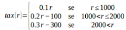

## **Programming** Fundamentals, Class 04

### Functions

###### this is an adaptation of the practical guide provided by Professor João Manuel de Oliveira e Silva Rodrigues

#### Exercises

1. The **[bmi.py](https://github.com/alexandradecarvalho/programming-fundamentals/blob/main/practical-classes/lab04/bmi.py)** calculates the body mass index, but it is incomplete. The program includes three functions. Analyse-it.

   a) Complete the `bodyMassIndex` function definition to calculate the index with BMI = weight / (height²). Complete the arguments in the function invocation, inside the main function. Test the program.

   b) Complete the bmiCategory function to return a string with the correspondent body mass category. Add a call to this function in the main function, to get the name of the category. Test the program again.

2. Write a function to calculate the polynomial `p(x) = x² + 2x +3`  and use it in a program to calculate and show the values of p(0), p(1), p(2) and p(p(1)). Confirm the results.

3. Define a function that returns the biggest out of its two arguments. For example, `max2(4,3)` should return 4 while `max2(-3,-2)` should return -2. You mustn't use the pre-defined `max` function. Use an `if` instruction. Test the function with several argument sets.

4. In the same program, develop a function that returns the biggest out of its 3 arguments. You mustn't use the max function, nor conditional instructions, only the function you defined before. Test the new function.

5. Write a function, tax(r), which implements the following piecewise function:

   

   Use an if-elif-else instruction. Test the function with many r values and confirm the results. Which values must you test?

6.  Write a `intersects(a1,b1,a2,b2)` function that returns `True` if the [a1,b1[ and [a2,b2[ intervals intersect and returns `False` otherwise. Assume that a1 <= b1 and that a2 <= b2. **Hint:** its easier to understand when the intervals *don't* intersect.

7. Analyse and execute the **[dates.py](https://github.com/alexandradecarvalho/programming-fundamentals/blob/main/practical-classes/lab04/dates.py)** program. The `isLeapYear` function must indicate when a year is a leap year, but it has an error. Fix it. A year is a leap year if it is a multiple of 4, except at the end of each century (multiples of 100) when the years are leap years only if they are a multiple of 400.

8. In the same program, the function that determines the number of days in a month is also wrong. When the month is February, invoke the previous function to determine if the year is a leap year, in which case it should return 29 days.

9. Still in the same program, fix the `nextDay` function to correctly return the next day. 

10. Write a `countdown(N)` function which prints a countdown from a positive number N. Notice that you can `print(N)` and then do `countdown(N-1)`. Test the function with many N values.

11. The Euclidean algorithm to determine the maximum common denominator between two natural numbers is based on the following:

    

    where r is the remainder of the division of a by b. Write a function to calculate the maximum common denominator and test it with several pairs of values.
