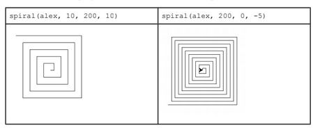

## **Programming** Fundamentals, Class 05

### Iterations

###### this is an adaptation of the practical guide provided by Professor João Manuel de Oliveira e Silva Rodrigues

#### Exercises

1. Execute and notice the effect of watch of the following code excerpts:

   | n = 4 while n > 0:     print(n)     n -= 1 | n = 1 while n < 1000:     print(n)     n *= 2 | for c in range(10):     print(c) |
   | --------------------------------------------------------- | ------------------------------------------------------------ | ------------------------------------- |

   

2. The program [**table.py**](https://github.com/alexandradecarvalho/programming-fundamentals/blob/main/practical-classes/lab05/table.py) shows a table with the four integers to the power. Try it. Modify the program to show that table to numbers between 1 and 20. Use the `range` function. Add a column to show 2^n. Fix the width of the columns and the alignment of the header. 

3. The program **[turtle.py](https://github.com/alexandradecarvalho/programming-fundamentals/blob/main/practical-classes/lab05/turtle.py)** shows how to use the `turtle` module to do simple drawings. Complete the spiral function to draw a spiral with sides which increase/decrease with an arithmetic progression, as shown below:

   

4. Consider the sequence (U0, U1,...) where the first term is U0 = 100 and the following are given by Um = 1.01*(Un-1) - 1.01. The **[sequenceUn.py](https://github.com/alexandradecarvalho/programming-fundamentals/blob/main/practical-classes/lab05/sequenceUn.py)** program generates the first 20 terms of the sequence. Change the program to show all positive terms. Notice that you should use a `while` instruction. In the end, the program should say how many terms it has shown.

5. Write a `factorial(n)` function that calculates the factorial of n, defined by n! = 1*2 *3 *... *n. Test the function against several n values.

6. The HiLo game consits in trying to guess an integer between 1 and 100. At first, the program choses a random number. Then, the user inputs a number and the program will tell if the number is to high or too low. This is repeated until the user finds the number. The game ends indicating how many guesses were needed. The [**hilo.py**](ttps://github.com/alexandradecarvalho/programming-fundamentals/blob/main/practical-classes/lab05/hilo.py) program already has an instruction to generate a random number using the function `randrange` from the `random` module. Complete the program to do the rest of the game.

7. Pi can be approximated by a truncated version of the Leibniz's series: 1 - 1/3 + 1/5 - 1/7 + 1/9 - ... = pi / 4. Write a `leibnizPi4(n)` function which returns the sum of the first n terms of the series. Test this function in a program which asks the user the value of n. 

8. Write a program which asks the user a sequence of real numbers. To end the sequence, the user must press ENTER, inputing an empty line. At that time, the program should show the maximum value, the minimum value and the average of the inputed numbers.

9. The Fibonacci sequence is a sequence of integers in which each element is the sum of the previous two: 0, 1, 1, 2, 3, 5, 8, 13,... so each term is Fn = (Fn-1) + (Fn-2). The first two values are F0 = 0 and F1 = 1. Write a `Fibonacci(n)` function to calculate the n-ieth number of Fibonacci. **Hint:** in each iteration update and store the last two values.

10. Write a `isPrime(n)` function which returns `True` if n is a prime number and `False` otherwise. N is prime if it isn't divided by any number besides 1 and N. **Hint:** try dividing by 2, by 3,.. If any of the numbers exactly divide N, then N is not a prime number. Test the function in a program which goes through all the numbers between 1 and 100 and indicates whether or not each of them are prime numbers.

11. Write a program which reads a positive integer from the keyboard, N, and prints the list of all its divisors (all numbers who divide N, except N). The program must also indicate if N is a *deficient, perfect or abundant* number:

    a) *Deficient number*: a number whose sum of divisors is lesser than the number itself. **ex:** 1+2+4+8 (all divisors of 16) < 16

    b) *Perfect number*: a number whose sum of divisors is equal to the number itself. **ex:** 1+2+3 (all divisors of 6) = 6

    c) *Abundant number*: a number whose sum of divisors is higher than the number itself. **ex:** 1+2+3+6+9 (all divisors of 18) > 18