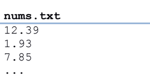
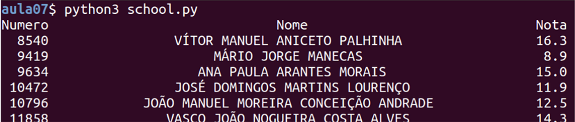
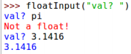

## **Programming** Fundamentals, Class 07

### Exceptions

###### this is an adaptation of the practical guide provided by Professor João Manuel de Oliveira e Silva Rodrigues

#### Exercises

1. Create a program that calculates the sum of a list of values, stored in a file. Consider that the file has only one value per line, as seen in the example below. The file name must be asked to the user.

   
   
   
   
2. The file [**mystery.txt**](https://github.com/alexandradecarvalho/programming-fundamentals/blob/main/practical-classes/lab07/mystery.txt) has lines with the words UP or DOWN or with a pair of numbers. UP and DOWN are instructions for turtle to raise or lower the pencil. The pairs of numbers are coordinates x,y for points. Complete the program **[turtledraw.py](https://github.com/alexandradecarvalho/programming-fundamentals/blob/main/practical-classes/lab07/turtledraw.py)** to read the instructions off of the file and use the turtle to draw. **Hint:** use the method `.split()` to divide the lines that have coordinates.

   ###### (this exercise was adapted from exercise 11.5 of the book “How to think like a computer scientist”)

3. The file **[school.csv](https://github.com/alexandradecarvalho/programming-fundamentals/blob/main/practical-classes/lab07/school.csv)** has a table with class grades. Each line has the record of one student and each column has a field of information. Columns are separated by TAB characters. The first line is a header with field titles. Complete the program **[school.py](https://github.com/alexandradecarvalho/programming-fundamentals/blob/main/practical-classes/lab07/school.py)**  to read and process that file.

   a) Complete the `loadFile(fname)` function so that, given a file name with the right format, reads its content and returns a list of a tuple by student. Each tuple must contain the fields (number, name, grade1, grade2, grade3). Use the `.split('\t')` method to divide each line and convert the grades and the numbers to the correct types.

   b) Create a `notaFinal(reg)` that, given a tuple with the record of a student, calculates and returns their final grade, the average of the three scores in the record.  

   c) Create a `printPauta(lst)` function that, given a list of student records, shows a table with their names, numbers and final grades, formatted and aligned as seen below. The name should appear centered, while the number and grade should appear aligned to the right. Use the `.format` method.

   

   

   d) Using the functions mentioned above, complete the main function to read the file, sort the list with the `.sort()` method and show the final table.

4. Alter the previous program to save the final table in a text file. You can use the `write` method or the `print` function with the `file=` argument. **Hint:** if you turn `printPauta` into a general function it can also receive an extra `file` argument so that it can be reused to save in the file. 

5. When we execute `float(input(...))`, there is the risk of a user inputting a text that will generate a `ValueError` during conversion.

   a) To deal with this problem, create a `floatInput(prompt)` function that reads and validates user input: it asks for a value, **tries** to convert it and, if it fails, warns the user and repeats everything, according to the interaction shown below.

   

   b) Add two arguments `min` and `max` and validate if the inputted value is inside the interval `[min,max]`. If it isn't, the function must warn the user and repeat everything, according to the interaction shown below.

   c) Make the `min` and `max` arguments optional. When omitted, the function must accept any real value (you can use `+- math.inf`).

6. Write a function `compareFiles`, that verifies whether two given files are the same. In order to save time and memory, it should read and compare in blocks of 1KiB at a time, and terminate as soon as it finds a difference. Open the files in **binary mode** and use the `read` function. Test the function in a program that receives the names of the files as arguments (1KiB is read "*one kibibyte*" and corresponds to 1024 bytes).

7. To know the size, in bytes, of a file, one can use the `os.stat("file").st_size`. Create a function that goes through a directory (with `os.listdir`) and shows the size of each file.
