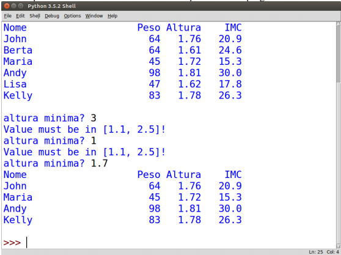

## **Programming** Fundamentals, Class 07 X

### Exceptions

###### this is an adaptation of the practical guide provided by Professor João Manuel de Oliveira e Silva Rodrigues

#### Exercises

1. In the `genFibonacci.py` program, complete the `genFibonacci(n)` function to **return** a list with the first n Fibonacci numbers. For example, if `n=6`, it should return `[0,1,1,2,3,5]`. The function has to work only for n>=2. Notice that the program already does several invocations and verifications of the results with `assert` instructions. So, if in execution there is an **AssertionError**, it means that the function is wrong. 

2. Write a function that verifies whether a string contains consecutive equal characters. For example, `containsDoubles("pool")` must return `True`. Write your function based on the `checkDoubles.py` program and verify it passes the tests. Add a few more adequate tests. Remember you should test **extreme cases**.

3. In the Unix/Linux systems, the `/usr/share/dict/words` file contains a list of English words, one word by line. In the `checkDoubles.py` program, complete the `findLinesWithDoubles` function to find out the words of that file which have duplicate letters.

4. Imagine you are doing a crossword puzzle (in English) and you're missing a word with the pattern "`?YS???Y`", where the "`?`" characters represent missing letters. Complete the `findWords.py` program to help you find out the missing word. The program already includes instructions to reading a list of English words from the `/usr/share/dict/words` file, which usually exists in Linux/Unix systems. Write the `filterPattern(lst,pattern)` to extract, from a list of strings, the one with the given pattern. Hint: firstly, create a functional `matchesPattern` function as indicated in the program, and use it in `filterPattern` to test each word.

5.  The `main` function in the `imctable.py` program defines a list with weights and heights of several people and invokes several functions to process and show that data. Analise the program and complete the missing functions in order to make the program work correctly.

   a) The `printTable` function must print a table with four columns: name, weight, height and body mass index (BMI). The BMI can be calculated by weight/height. The numeric columns should appear aligned to the right and with a fixed number of decimals, as seen below

   b) The `inputBetween` function must ask for and return a value introduced by the user, but only if is between the established limits. Otherwise, it must warn the user and ask for the value again until it falls under the acceptable range.

   d) The `selectTaller` must return a list with the records of all people taller than the the given threshold.

   The example below shows the intended interface.

   

   
