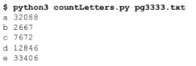
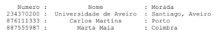

## **Programming** Fundamentals, Class 08

### Dictionaries

###### this is an adaptation of the practical guide provided by Professor João Manuel de Oliveira e Silva Rodrigues


#### Exercises

1. Try to predict the result and effects of each of the instructions below. Some of them don't have a result and others throw errors. Use Python in interactive mode to confirm your guesses.

   ```python
   shop = {'eggs':6, 'sugar':1.0}
   shop	# compare results!
   {'sugar':1,'eggs':6} == shop
   type(shop)
   len(shop)
   shop[0]
   shop['eggs']
   'eggs' in shop
   6 in shop
   shop[6]
   shop.get(6)
   shop['sugar'] = 2.0
   shop
   shop.append('beer')
   shop['beer'] = 6*0.33
   shop	# compare results!
   len(shop)
   shop['beer'] += 0.33
   shop
   shop.keys()
   shop.items()
   
   d = {}
   type(d); len(d); d
   d[93542] = {'maria', 'P1'}
   d[95612] = {'daniel', 'P2'}
   d[76367] = {'john', 'P1'}
   len(d); d	# compare results!
   d[95612][1]
   for x in d:
       print(x,d[x])
   for x,y in d.items():
       print(x,y,sep='->')
   t = {'P1':[], 'P2':[]}
   for x in d:
       t[d[x][1]].append(d[x][0])
   len(t['P1'])
   t	# compare results!
   t.pop('P2')
   t
   ```

   

2. Write a program that determines the frequency of the occurrence of all **letters** from a text file. The name of the file should be passed as a command line argument (use `sys.argv`). Download "**[Os Lusíadas](https://github.com/alexandradecarvalho/programming-fundamentals/blob/main/practical-classes/lab08/pg3333.txt)**" (**document 3333 of the Gutenberg Project**) and count over it. Adjust the program not to distinguish upper and lower cases. Finally, modify the program to show the results in alphabetical order. **Hint:** use `str.isalpha()` to detect letters and `str.lower()` to convert them to lower case.

   

   

3. The [**telefone.py**](https://github.com/alexandradecarvalho/programming-fundamentals/blob/main/practical-classes/lab08/telefone.py) program, already provided, simulates a phone list, implemented as a dictionary. The program presents a menu with five operations. The "list contacts" operation is already implemented. Try and analyse the program.
   a) Add the "add contact" operation. It should ask for a name and a number and add it to the dictionary.
   b) Add the "remove contact" operation. It should ask for the number and delete the correspondent item (use the `del` operator or the `pop` method).
   c) Add the "find number" operation. It should ask for a number and show the correspondent name, if it exists, or the number itself otherwise. **Hint:** you could use the `get` method (this is the same as the exercise 3a from **[lab06](https://github.com/alexandradecarvalho/programming-fundamentals/blob/main/practical-classes/lab06)**, but now with a dictionary).
   d) Complete the `filterPartName` function, which given a string, should return a dictionary with the contacts (name: number) whose names include that string (similar to the exercise 3b from **[lab06](https://github.com/alexandradecarvalho/programming-fundamentals/blob/main/practical-classes/lab06)**). Use that function to implement the "search part of the name" operation, which must ask for a partial name and list all contacts who contain it.

4. Adapt the previous program to allow associating an address to a contact. **Hint:** change the dictionary to support (name, address) pairs as *values* associated to each keys. Change the listing function to show the data in 3 columns with fixed widths, as it can be seen below: number adjusted to the right, name centered in the column, address adjusted to the left. Use the format method for strings. Also adjust the other operations accordingly.
   

5. Create a program that allows the management of a football tournament.
   a) The program should ask the user the names of the teams and store them in a list.
   b) Use the function created in [**lab06**](https://github.com/alexandradecarvalho/programming-fundamentals/blob/main/practical-classes/lab06), for exercise 4, to generate a list of all games. Each game is represented by a pair (team1,team2).
   c) The program should ask the user the result of each game (goals per team) and register that information in a dictionary indexed by game. For example: `result[('FCP','SLB)] -> (3,2)`.
   d) The program should keep a table with the record of number of wins, ties and losses, total of scored and suffered goals, and the points of each team. With the result of each game, both teams' records should be updated. The best is to keep the records in another dictionary indexed by team. For example: `table['SLB'] = [0,0,1,2,3,0]`.
   e) At the end, show the scores table with the following columns: team, victories, ties, losses, scored goals, suffered goals, and points. Challenge: can you sort the table decreasingly by points? 
   f) Finally, presenting the winner team! The winner team is the with the highest amount of points or, in case of a tie, the one with the biggest difference between scored and suffered goals.

6. Each line of the **[stocks.csv](https://github.com/alexandradecarvalho/programming-fundamentals/blob/main/practical-classes/lab08/stocks.csv)** file has the following format: `Name, Date, OpeningPrice, MaxPrice, MinPrice, ClosingPrice, Volume`. Create a program that reads that file and determines:
   a) The most transacted company (with highest total volume).
   b) The day and value of each stock to attain the highest value.
   c) The company with biggest daily valuation.
   d) The company with the biggest valuation during the period in the file.
   e) Create a function that calculates the valuation of a certain *portfolio* in between two given dates. The portfolio should be a dictionary with the number of actions of each title, e.g.: `{'NFLX': 100, 'CSCO': 80}`.

7. The **[coins.py](https://github.com/alexandradecarvalho/programming-fundamentals/blob/main/practical-classes/lab08/coins.py)** program has a set of functions to manage coin bags. Each *bag* is represented by a dictionary that associates each type of coin to the number of those coins in the bag. The list `COINS` has all types of valid coins, by decreasing order of value (in cents).
   a) Complete the `value(b)` function to return the total amount in the bag b.
   b) Complete the `transfer1coin(b1,c,b2)` function to try to transfer a coin of type `c` from bag `b1` to bag `b2`. If `b1` doesn't have any coins of type `c`, the function must return `False` and let the bags unchanged. If it has, then it should return `True` and update the number of coins of both bags.
   c) Complete the `transfer(b1, a, b2)` function to try to transfer an amount a from `b1` to `b2`. It should do this by transferring one coin at a time. If it is possible to do this, the function must return `True` and update the bags. If it is not possible, the function should return `False` and keep the bags unchanged. **Warning:** this is a complex problem.
   d) Change the `strbag(bag)` function to return a string with a friendlier representation, with the quantities of coins, decreasingly, of each type of coin, for example.
