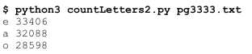
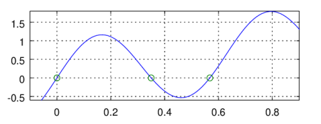

## **Programming** Fundamentals, Class 10

### Search, Sorting and Lambda Expressions

###### this is an adaptation of the practical guide provided by Professor João Manuel de Oliveira e Silva Rodrigues


#### Exercises

1. Execute the following instructions in interactive mode and interpret the results.

   ```python
   l = ["Mario","Carla","anabela","Maria","nuno"]
   sorted(l)
   sorted(l,reverse=True)
   sorted(l,key=len)
   l[0].casefold()
   str.casefold(l[0])	# equivalent
   sorted(l,key=str.casefold)
   def lenFold(s):
       return (len(s),s.casefold())
   lenFold(l[0])
   sorted(l,key=lenFold)
   
   d = [('Republic',1910,10,5),('Christmas',1,12,25),('Liberty',1974,4,25),('Restoration',1640,12,1)]
   sorted(d)
   sorted(d, key=lambda t:(t[2],t[3]))
   
   n = [3,4,4,4,6,7,7,8]
   import bisect
   bisect.bisect_left(n,6)
   bisect.bisect_left(n,10)
   bisect.bisect_left(n,4)
   bisect.bisect_right(n,4)
   ```

   

2. In **[lab08](https://github.com/alexandradecarvalho/programming-fundamentals/blob/main/practical-classes/lab08)** we made a program that counts letter occurrences in a text file. Make a new version of that program that lists the result decreasingly by occurrence. Use the `sorted` method with the `key=` and `reverse=` arguments to sort the key-value (`items`) pairs sequence.<br>
   
3. The **[tabelaFutebol.py](https://github.com/alexandradecarvalho/programming-fundamentals/blob/main/practical-classes/lab10/tabelaFutebol.py)** file has a list of classifications for a football tournament. Each list element is a tuple with the name of the team, number of victories, number of ties, number of losses, scored goals and suffered goals. The program already has a function to show the formatted table and a function, defined by a lambda expression, that determines the number of games made by each team. Complete the program in the appropriate places to solve each of the following problems:
   a) Complete the **lambda expressions** to define the `pontos` function that, given a team record, returns the number of points of that team (each victory is worth 3 points while each tie is only worth 1 point). 
   b) Add the adequate arguments to the `sorted` function to get an ordered table by decreasing points.
   c) Add the adequate arguments to the `sorted` function to get an ordered table by decreasing difference between scored and suffered goals.
   d) Add the adequate arguments to the `sorted` function to get an ordered table by decreasing points, and, if there are teams with equal points, by the difference of goals.

4. Write a function that calculates the median of a list of values. Median is the value higher than half the elements of the list and lower than the other half. If the list has an odd number of elements, the median is the value in the middle of the list. If the list has an even number of elements, it is the average between the two middle values of the ordered list.

5. In Unix/Linux systems, the file `/usr/share/dict/words` has an ordered list of English words. Read those words into a list and, using a binary search function (from the `bisect` module), find out how many words start with "ea" without going through all of them. **Hint:** search for the first word starting with "ea" and the first word starting with "eb" and subtract the indexes. How many words start with "tb"? None? Then, what's the first word higher than 'b' to appear after a 't' in English words?

6. Using the same principle, write a function that shows all letters that can come after a given prefix. This function could be used in a system of intelligent writing, that suggests possible letters to complete an already introduced prefix. When a user inserts a new letter, it is appended to the prefix and the system shows a new list of possibilities, and so on.

7. The **[insertionSort.py](https://github.com/alexandradecarvalho/programming-fundamentals/blob/main/practical-classes/lab10/insertionSort.py)** program has an implementation of the insertion sort algorithm. Modify it so that it takes an optional argument `key=` which does the same thing as it does in the pre-built function `sorted`.

8. In the **[polynomial.py](https://github.com/alexandradecarvalho/programming-fundamentals/blob/main/practical-classes/lab10/polynomial.py)** program we wish to implement a function that creates an arbitrary second-degree polynomial. This means, `p=polynomial2(2,-1,3)` should assign to `p` a **function** so that `p(x)` calculates the value `p(x) = 2x²-x+3` to any given value of `x`. Notice that, every time `polynomial2` is executed, you must define a new function to return. This definition could be done with a `def` instruction or a `lambda` expression.

9. The f(x) = x+sin(10x) function (see the graph below) has a root (and a zero) in the [0.2,0.4] interval. We know this because it is within the conditions of the Bolzano's theorem: it is a continuous function that changes sign between the edges of that interval, since f(0.2) > 0 ^ f(0.4) < 0. As a matter of fact, this function has another root within [0.4,0.6]. Find each of those roots using the *bisect method*. This is a successive approximations method that, in each iteration, reduces the interval containing the root by half. When the amplitude of the interval is less than the wished precision, we stop. This is a form of binary search, but instead of searching in a list, it "searches" in a real function of real variables. 



