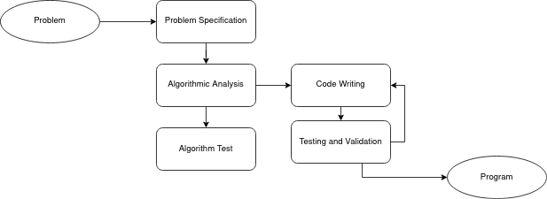

## Programming Fundamentals, Class 01

###### this is an adaptation of the materials provided by Professor João Manuel de Oliveira e Silva Rodrigues


### Abstract

* What is a computer?
* What is a program?


### Computer

* In and Out (I/O) Peripherals
  * Monitor/Display/LCD, Mouse/Trackpad/Touchpad, Keyboard
* Processing Units
  * CPU, GPU
* Storage Units
  * Volatile: RAM
  * Persistent: Disk/SSD, CDROM
* Communication Units
  * Wireless Cards, Ethernet, Bluetooth
* Motherboard
  * Connects all components


### CPU & GPU

* CPU: Central Processing Unit
  * Usually has many processing cores (1, 2, 4, ...)
  * Several levels of internal memory (cache) L1, L2, L3
* Essentially: transfer and operate on data:
  * Store and retrieve data from memory
  * Add, subtract, multiply, divide
  * Compare values
* Execute instructions sequentially
* But can also jump to back or forward instructions
* Can also run conditionally:
  * If x < 0 do this, else do that


### Memory Organization

* The minimum memory unit is binary, it only distinguishes two states:
  * loaded or unloaded, on/off, 1 or 0
* It is called a bit (from binary digit)
* All data (numbers, text, images, etc.) are encoded and stored in groups of bits
* A set of 8 bits is called a byte
* Computer memory is many bytes and locates each through an individual numeric address.


### Operating System

* Program run by a processor with access to hardware
* Manages:
  * Hardware
  * Applications
  * File System
  * Memory 


### Program Development Stages

The two basic steps of program development are the problem analysis and the application implementation




### Tool Examples

* VIM
* Nano
* Sublime Text
* Notepad++
* PyCharm


### Program Examples

```python
name = input('What is your name?')
print('hello ' + name)
```

