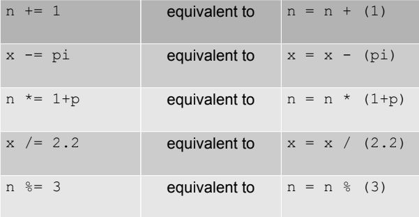
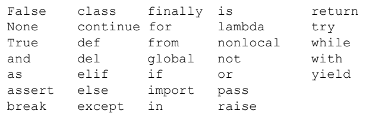
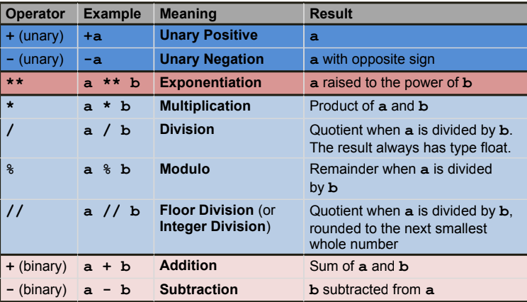

## Programming Fundamentals, Class 02

###### this is an adaptation of the materials provided by Professor João Manuel de Oliveira e Silva Rodrigues


### Topics

* Getting started with Python
* Values and types
* Variables
* Keywords
* Operators, expressions and statements
* Functions
* Console input/output
* Scripts


### Getting started with Python

* Python is a **general purpose** programming language well known for its elegant syntax and readable code
* With Python it is possible to do everything from GUI development, web applications, system administration tasks, data analysis, visualization, etc.
* Python is an **interpreted** language - an interpreter parses and executes a Python program on a line by line basis. This is usually slower than compiled languages
* In Python, basic data structures and small utility functions are built-in, you don't need to define them
* Moreover, Python has hundreds of extension libraries (modules) available at https://pypi.Python.org/


### Python in interactive mode

* There are two ways to use the interpreter: interactive mode and script mode

* Execute `pyhton3` with no argument to run in **interactive mode**. Then, type *Python* statements and the interpreter displays the result:

  ```python
  $ python3
  >>> 1 + 1
  2
  >>>
  ```

* The chevron, >>>, is the **prompt** the interpreter uses to indicate that it is ready

* When you type an expression, the interpreter prints the result. Then, it shows the prompt again


### Python in script mode

* Alternatively, you can store the statements in a file, which is called a **script** or **program**, and use the interpreter to execute it. By convention, *Python* scripts have names that end in **.py**

* To execute the script, just call the interpreter and pass it the name of the file. For example:

  ```python
  $ python3 test.py
  The result is
  42
  ```

  

* In **script mode**, Python does not show the prompt and does not print results automatically. You need to call `print()`

* The details of executing scripts may differ


### Script mode programming

* Invoking the interpreter with a script parameter begins the execution
  of the script. Python files have extension **.py**
* Lines and indentation - blocks of code are denoted by line **indentation**, which is rigidly enforced. The number of spaces in the indentation is variable, but all statements within the block must be indented the same amount
* Statements in Python typically end with a new line. However, a backslash ( \ ) in the end of the line indicates that the statement continues in the next line
* The semicolon ( ; ) allows multiple statements on a single line
* A line containing only whitespace is known as a blank line and Python totally ignores it
* * Hardware
  * Applications
  * File System
  * Memory 


### What is a program?

* A program is a sequence of statements that specifies how to perform a computation. The details look different in different languages, but a few basic types of statement appear in just about every language:
  * **assignment:** store values in variables, to recall later on
  * **math:** perform basic mathematical operations
  * **input:** get data from the keyboard, a file, or some other device
  * **output:** display data on the screen or send data to a file
  * **conditional execution:** check for certain conditions and execute the appropriate code
  * **repetition:** perform some action repeatedly, usually with some variation
* That is pretty much all there is to it. Every program, no matter how complicated, is made up of statements like these.


### Errors and Debugging

* Programming errors are called **bugs**
* Tracking down and correcting bugs is called **debugging**
* There are three kinds of errors: syntax errors, runtime errors, and semantic errors
* A **syntax error** occurs if the program contains code that does not respect the rules of the programming language
* A **runtime error** only appears after the program has started running. These errors are also called **exceptions** because they indicate that something exceptional (and wrong) has happened
* If there is a **semantic error** in a program, it may run with no error messages, but it will produce the wrong results. The program is not doing what the programmer *intended*. It is doing *exactly* what it was *told* to do


### Values and Types

* A **value** is one of the basic things a program works with, like a letter or a number: 33, 3.14, 'ola', 1+2j

* Values belong to different **types** (or **classes**): int, float, str, complex

* It is possible to ask the interpreter about it:

  ```python
  >>> type('Hello, World!')
  <class 'str'>
  >>> type(17)
  <class 'int'>
  >>> type(3+5j)
  <class 'complex'>
  ```

  

* Types determine what you can do with values. For instance, you cannot add ints and strings:

  ```python
  >>> 3 + 'cats'
  TypeError: unsupported operand type(s) for +: 'int'
  and 'str'
  ```


### Data types

* Python has several built-in data types, including:
  * Numeric types: int, float, complex
  * Sequences: Strings (str), list, tuple
  * Sets: set
  * Mappings: Dictionary (dict)
  * Boolean (bool): True and False are the only boolean literals
  * (In conditional instructions, the following values are also considered as false: 0 - zero, 0.0, [] - empty list, () - empty tuple, {} - empty dictionary)
* You can define new data types – called classes – but we’ll leave that for another course


### Conversion between types

* Sometimes we need to convert values to a different type

* We use type conversion functions: str, int, float, ...

* Just about any kind of value may be converted to string:

  ```python
  >>> str(1+2)
  • '3'
  • >>> str(1.0/2)
  • '0.5'
  ```

  

* In fact, this happens implicitly when you `print` values

* Some strings may be converted to int or float:

  ```python
  >>> 100 + int('33')
  • 133
  • >>> float('0.12') / 10000
  • 1.2e-05
  ```

  

* Converting a float to int truncates toward zero:

```python
>>> int(2.78)
2
```


### Variables and Assignment

* A **variable** is a name (aka identifier) that refers to a value

* An **assignment statement** assigns a value to a variable

  ```python
  >>> n = 5
  >>> pi = 3.14
  ```

  

* In an expression, a variable is substituted by its value

```python
>>> 2*pi*n
31.4000
```


* You can assign a new value to a variable. The old value is forgotten!

  ```python
  >>> n = n+1
  >>> print(n)
  6
  ```

  

* Variable names may include both letters and digits, but they must begin with a letter

* If you give a variable an illegal name, you get a syntax error:

  ```python
  >>> 76trombones = 'big parade'
  SyntaxError: invalid syntax
  ```

  

* Python allows simultaneous assignment like this:

```python
name, age, height = "Maria", 21, 1.63
```


* There are special augmented assignment operators:




### Keywords

* The interpreter uses **keywords** to recognize the structure of the program
* Keywords are *reserved* words: they cannot be used as variable names or any other identifier
* In Python3, the keywords are:




### Operators, expressions and statements

* **Operators** are special symbols that represent computations (+, -, *, /, **, %, <=, or)
* The values combined by operators are called **operands**
* For a given operator, operands must have compatible types. The result type depends on the operand types
* An **expression** is a combination of values, variables, and operators
* A **statement** is a unit of code that the Python interpreter can execute
* The important difference is that an expression has a value (even if **None**); a statement does not
* In script mode, an expression, all by itself, has no visible effect (unlike interactive mode)


### Arithmetic Operators: descending precedence by colour




### Operators and precedence

* When more than one operator appears in an expression, the order of evaluation depends on the rules of precedence (**PEMDAS**)
* Use parentheses to make it obvious!
* The + operator performs concatenation in **strings**
* The * operator also works on **strings**; it performs repetition. For example, 'Ah'*3 is 'AhAhAh'
* It is a good idea to add notes to a program to explain in natural language what the program is doing. These notes are called comments, and they start with the # symbol


### Calling functions

* In the context of programming, a **function** is a named sequence of statements that performs a computation

* We’ll see how to *define* functions later

* Functions are **called** (or **invoked**) by name:

  ```python
  >>> print(10*t, "km")
  30 km
  ```


* The name of the function is `print`
* The expressions in parentheses are called the *arguments* of the function. There are two, in this case
* A function “takes” zero or more arguments and “returns” a result and/or produces some *effect* (such as *printing* something or *storing* something)


### Math functions

* Python has a math module that provides most of the familiar mathematical functions

* A module is a Python file that defines a collection of related functions and objects

* Before using a module, it should be imported:

  ```python
  >>> import math
  ```


* To access one of the functions, specify the name of the module and the name of the function, separated by a dot

```python
>>> degrees = 45
>>> radians = degrees / 360.0 * 2 * math.pi
>>> math.sin(radians)
0.707106781187
```


### Receiving input from the console

* The **input** function is used to get input from the console
* It has an optional argument called the *prompt* and returns a string

```python
>>> name = input("What's your name? ")
What's your name? tim
>>> name
'tim'
```


* To get other types of values, you must convert!

```python
>> age = int(input(‘Enter your age: ‘))
Enter your age: 22
>>> age
22
>>> type(age)
<class 'int'>
```


### Sending input to the console

* To output text to the screen, use the print function:
  `print("Hello World")`
* To write multiple lines, add the ‘\n’ character:
  `print("Hello World\nThis is a message")`
* To print multiple values (separated by blanks):
  `print("speed =", v)`
* The print function has some optional keyword arguments:
  `print(..., sep=' ',end='\n',file=sys.stdout,flush=False)`
* Use `sep=` and `end=` to change how arguments are separated and terminated in the output
* Use `file=` to send output to a different stream (e.g. file)

```python
>>> fh = open("data.txt", "w")
>>> print(“Some text", file=fh)
>>> fh.close()
```

