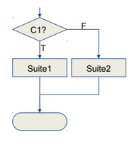

## Programming Fundamentals, Class 03

###### this is an adaptation of the materials provided by Professor João Manuel de Oliveira e Silva Rodrigues


### Topics

* Boolean expressions

* Conditional execution

* Conditional expressions

  

### Boolean expressions

* A boolean expression is an expression that is either true or false

  ```python
  >>> n = 5 # this IS NOT a boolean expression!
  >>> n == 5 # this IS a boolean expression!
  True
  >>> 6 == n # this is another boolean expression.
  False
  ```

  

* True and False are special values that belong to the type `bool`

* Boolean values may be stored in variables or converted to strings or integers

  ```python
  >>> isEven = n%2==0
  >>> str(isEven)
  'False'
  >>> int(False) # 0
  >>> int(True) # 1
  ```

  

* Null and empty values convert to False while other values convert to True:

  ```python
  >>> bool(0) # False
  >>> bool(0.0) # False
  >>> bool('') # False
  >>> bool([]) # False
  >>> bool(1) # True
  >>> bool('False') # True (surprise!)
  >>> bool([False]) # True (surprise?)
  ```

  

### Relational and logical operators

* **Relational operators** produce boolean results:

  ```python
  x == y # x is equal to y
  x != y # x is not equal to y
  x > y # x is greater than y
  x < y # x is less than y
  x >= y # x is greater than or equal to y
  x <= y # x is less than or equal to y
  x < y < z # x is less than y and y is less than z (cool!)
  ```

  

* There are three **logical operators**: `and, or, not`

  ```python
  x>=0 and x<10 # x is between 0 and 10 (exclusive)
  0<=x and x<10 # same thing
  x==0 or not isEven and y/x>1
  ```

  

* Remember these properties:

```python
x == y <=> not x != y <=> y == x
x != y <=> not x == y <=> y != x
x > y <=> not x <= y <=> y < x
x <= y <=> not x > y <=> y >= x
not (not A) <=> A
not (A and B) <=> (not A) or (not B)
not (A or B) <=> (not A) and (not B)
A or B <=> B or A
A and B <=> B and A
A or (B and C) <=> (A or B) and (A or C)
A and (B or C) <=> (A and B) or (A and C)
```


### Precedence rules

* Arithmetic > relational > not > and > or


### Short-circuit evaluation

* Operators and and or only evaluate the second operand if needed!

* ```python
  $ python3 test.py
  The result is
  42
  ```

  ```python
  X and Y # if X is false then X, otherwise Y
  X or Y # if X is true then X, otherwise Y
  ```

  

* This is called **short-circuit evaluation**

* It can be very useful:

  ```python
  1/n>2 and n!=0 # ZeroDivisionError if n==0
  n!=0 and 1/n>2 # False if n==0, 1/n not evaluated
  n==0 or 3/n<4 # True if n==0, 3/n not evaluated
  ```

  

* But remember: commutative and distributive properties may not be valid!


### Conditional execution

* **Conditional statements** allow the program to check conditions and change its behavior accordingly

* The simplest form is the if statement:

  ```python
  if condition:
  statements
  ...
  ```

  

* The *condition* is an expression of any type, but it is **implicitly converted** to `bool`. (**Warning**: this may be **surprising**! Please use proper boolean expressions)

* The indented **suite of statements** gets executed if the condition is true. If not, execution continues after the indented statements

* The suite must have one or more statements

* A second form of the if statement is alternative execution, in which there are two possibilities and the condition determines which one gets executed

```python
if x%2 == 0:
print('x is even')
else:
print('x is odd')
#END
```



* Sometimes there are more than two possibilities and we need more than two branches (chained conditional)

  ```python
  if x < 10:
  mark = 'Poor'
  elif x < 13:
  mark = 'Reasonable'
  elif x < 17:
  mark = 'Good'
  else:
  mark = 'Excelent'
  
  print(mark)
  ```


* One conditional can also be nested within another

  ```python
  if x == y:
  print('x and y are equal')
  else:
  if x < y:
  print('x is less than y')
  else:
  print('x is greater than y')
  ```

* Although the indentation makes the structure apparent, deeply nested conditionals become difficult to read

* If possible, apply properties and code transformations to simplify nested conditional statements


### Conditional expression

* Python also includes a conditional expression, based on a ternary operator: `expression1 if condition else expression2`

* Uses keywords if and else, but it’s not a statement!

* The condition is evaluated first

* If true, then expression1 is evaluated and is the result

* If false, then expression2 is evaluated and is the result

  ```python
  n = int(input("number? "))
  msg = "odd" if n%2!=0 else "even"
  print(n, "is", msg)
  ```
