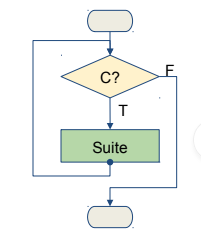
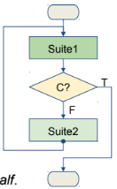
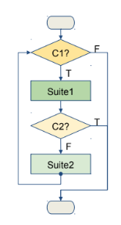

## Programming Fundamentals, Class 05

###### this is an adaptation of the materials provided by Professor João Manuel de Oliveira e Silva Rodrigues


### Summary

* The `while` statement
* The `for` statement
* The `range` function


### The `while` statement

* The `while` statement tells Python to **repeatedly execute** some target
  statements for as long as a given condition is true

| Syntax                                                 | Example                                                      |
| ------------------------------------------------------ | ------------------------------------------------------------ |
| ...<br />while condition:<br />    statements<br />... | n=3<br />while n>0:<br />    print(n)<br />    n = n-1<br />print("GO") |


* If the `condition` is true, the `statements` are executed

* Then, the condition is re-evaluated, and if still true, the statements are repeated

* When the condition becomes false, the execution skips to the line immediately following the loop

* The condition is an expression, which is converted to `bool`, so any null or empty value means false

  


### The `break` statement

* The *body* of the loop should change the value of one or more variables so that eventually the condition becomes false and the loop terminates. Otherwise, the loop will repeat forever, which is called an *infinite loop*

* Quite often the best place to decide if the loop should stop is halfway through the body. In that case you can use the `break` statement to jump out of the loop

  ```python
  while True:	
      line = input('Enter text? ')
      if line == 'done':
          break
      print(line)
  print('The end')
  ```

  

* A loop with this pattern is sometimes called a *loop-and-a-half*



### Multi-Exit Loops

* Sometimes there are several conditions to terminate the loop and multiple places to test them along the body of the loop

* Use multiple if-break statements to achieve that

  ```python
  while C1:
      Suite1
      if C2: break
      Suite2
      if C3: break
      Suite3
  ...
  ```





### The `for` statement

* Another loop mechanism is the `for` statement

* It repeats statements once for each item in a *collection* of items, such as a list, a string or a tuple

  | Syntax                                                       | Example                                               |
  | ------------------------------------------------------------ | ----------------------------------------------------- |
  | ...<br />for var in collection:<br />    statements<br />... | for n in [3,1,9]:<br />    print(n)<br />print("End") |

  

* The *collection* is an expression and it is evaluated first

* Then, the first item in the collection is **assigned** to the iterating variable `var`, and the statements block is executed once

* Next, the second item is assigned to `var`, the statements are executed again, and so on, until the entire collection is exhausted


### The `range` function

* The built-in function `range` generates a sequence of numbers in arithmetic progression: `list(range(4)) -> [0,1,2,3]`

* The `range` function is often used in for loops

  ```python
  for n in range(1,4):
      print(n)
  ```

  

* It may be called with 1,2 or 3 arguments, as follows:

  * range(stop)
  * range(start,stop)
  * range(start,stop,step)

* All arguments must be **integers**

* All arguments can be positive or negative

* Generates integers up/down to, but **not including**, `stop`

  

### Loop Control Statements

* Loop control statements change the execution from its normal sequence (**break, continue, pass**)

* **break** terminates the loop execution and jumps to the statement immediately following the loop

* The **continue** statement jumps to the beginning of the current loop, skipping to the next iteration, without executing the remaining statements in the current iteration

* **pass** is used when a statement is required syntactically but nothing needs to be executed. Nothing happens when it is executed. The pass statement is also useful in places where the code will eventually go, but has not been written yet

  

### The `else` Clause

* The iteration statements may have an optional `else` clause

  ```python
  count = 0
  while count < 5:
      print(cout, "is less than 5")
      count += 1
  else:
      print(count, "is not less than 5")
      
  print("End")
  ```

  

* Statements in the `else` clause are executed once, when the condition evaluates to false

* They are not executed only if a `break` terminates the loop

* This feature is **unusual**, **confusing** and seldom used

