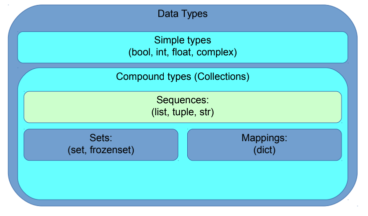
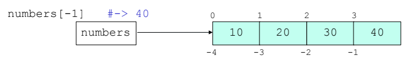
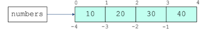
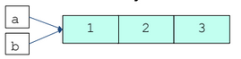
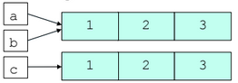

## Programming Fundamentals, Class 05

###### this is an adaptation of the materials provided by Professor João Manuel de Oliveira e Silva Rodrigues


### Summary

* Lists
* Tuples
* Strings


### Sequences

* Python data types:

  

  

### Lists

* A **list** is a **sequence** of values of any type

* The values in a list are called *elements* or sometimes *items*

* List literals are written in brackets

  ```python
  numbers = [10,20,30,40]
  fruits = ['banana', 'pear', 'orange']
  things = ['spam', 2.0, 5, [1,2]]	# a list inside!
  empty = []
  ```

  

* Function `len` returns the *length* of a collection

  ```python
  len(numbers)	#->4
  len(things)		#->4
  len(empty)		#->0
  ```

  

### Indexing

* We can access each element of a sequence using the bracket operator and a value - the *index*

  ```python
  numbers[0]	#->10
  fruits[2]	#->'orange'
  ```

  

* A negative index counts backward from the end



* Any integer expression may be used as an index: `numbers[(6+1)%4] #-> 40`
* Using an index outside the list bounds is an error

```python
numbers[4]	#->IndexError
numbers[-5]	#->IndexError
```


### Slicing

* We can extract a *subsequence* using **slicing**

  ```python
  numbers[1:3]	#->[20,30]
  numbers[0:4:2]	#->[10,30] (step=2)
  numbers[2:2]	#->[]
  ```





* Negative indexes may be used too

```python
numbers[-4:-2]	#->[10,20]
numbers[1:-1]	#->[20,30]
```


* Indexes may be omitted for the start or end

```python
numbers[:2]	#->[10,20]
numbers[3:]	#->[40]
numbers[:]	#->a full copy of numbers
```


### Traversing

* The most common way to traverse the elements of a sequence is with a `for` loop

```python
for f in fruits:
    print(f)
```


* But sometimes we use the indexes, e.g., when updating

```python
for i in range(len(numbers)):
    numbers[i] = numbers[i]*2
```


* In this case we could have used a while loop instead

```python
i=0
while i < len(numbers):
	numbers[i] = numbers[i]*2
	i += 1
```


### Sequence Operations and Methods

* The `+` operator concatenates and `*` repeats sequences

```python
s =[1,2,3] + [7,7]	#->[1,2,3,7,7]
z = [0]*3			#->[0,0,0]
```


* Operator `in` checks if an element is included in the sequence. Operator `not in` means the opposite

```python
7 in s		#->True
4 not in s	#->True
```


* Some methods allow finding and counting elements

```python
s.index(7)	#->3
s.count(7)	#->2
```


* Some built-in functions apply to sequences

```python
sum(s)			#->20
min(s), max(s)	#->1,7
```


### Lists are mutable

* Lists are **mutable**, i.e., we can change their contents

```python
numbers[1] = 99
numbers	#-> [10,99,20,40]
```


* We can even change a sublist

```python
numbers[2:3] = [98,97]
numbers	#->[10,99,98,97,40]
```


* Lists have several methods to change their contents

```python
z = [1,2]
z.append(3)	#appends 3 to the end of z -> [1,2,3]
x = z.pop() #z -> [1,2], x = 3
z.extend([4,5])	#z -> [1,2,4,5]
z.insert(1,6)	#z -> [1,6,2,4,5]
x = z.pop(0)	#z -> [6,2,4,5], x = 1
```


### Mutability and Aliasing

* In Python, variables store **references** to objects

```python
a = [1,2,3]
b = a
# a and b refer to the same objects! In other words, a and b are aliases
```





* Object contents may change, but the object **is the same**!

```python
b[0] = 9	# object referenced by b is modified
b			#-> [9,2,3] (of course!)
a			#-> [9,2,3] (do you get it?)
# This effect is known as aliasing in computing
```


* We can confirm that `a` and `b` refer to the same object: `a is b #-> True`


### Equality *versus* Identity

* Objects may be *equal* without being *the same*!

```python
a = [1,2,3]
b = a
c = a[:]
```





* We test **equality** with `==` (or `!=`)

```python
a == b	#->True
a == c	#->True
a != b	#->False
a != c	#->False
```


* We test **identity** with `is` (or `is not`)

```python
a is b	#->True
a is c	#->False
a is not b	#->False
a is not c	#->True
```


* Identity **implies** equality!
* Equality **does not imply** identity


### Identity and immutable types

* Don't use `is` when you mean `==`!

```python
[1,2] == [1,2]	#->True
[1,2] is [1,2]	#->False
"abx"[:2] == "ab"	#->True
"abx"[:2] is "ab"	#->False (probably...)
1000+1 is 1001		#->False (probably...)
```


* For some immutable types, Python can **sometimes** detect equal values and share the same object to save space

```python
"ab" is "ab"	#-> probably True, but...
10+1 is 11		#-> probably True, but...
```


* This is implementation-dependent, so **do not rely on it**!


### Cloning

* Sometimes, we need to make **a copy** of an object,so we can change it without changing the original
* To clone lists, we may use the slicing operator `[:]`

```python
a = [1,2]
b = a[:]	#slicing creates a new list
b is a 		#-> False
b.append(3)	#b -> [1,2,3]
```


* We could also use the more general `copy` method

```python
b = a.copy()	# clone a
b is a 			#-> False
```


* Other mutable types (such as sets and dictionaries) also have a `copy` method

* Immutable tyles (tuples,strings) don't need one


### Lists - More Operations

* If we know the index of the element to delete we can use `pop` - it modifies the list and returns the element that was removed
* If we don't need the removed value, we can use the `del` operator
* If we know the element to remove (but not the index), we can use `remove`
* To remove more than one element, we can use `del` with a slice index
* `sort` arranges the elements of the list from low to high


### Strings

* Strings are **sequences** of characters
* String literals are delimited by single or double quotes: `fruit = "orange"`
* Like other sequences, we can use indexing and slicing

```python
letter = fruit[0]	#-> 'o' (1st character)
len(fruit)			#-> 6 (length of string)
fruit[1:4] 			#-> 'ran'
fruit[:-1] 			#-> 'orang'
fruit[::-1]			#-> 'egnaro'
```


* We can also **concatenate** and **repeat** strings

```python
name = "tom" + "cat"	#-> "tomcat"
gps = 2 * "tom"			#-> "tomtom"
```


### Strings are Immutable

* Unlike lists, strings in *Python* are **immutable**. Once a string is created it can't be modified: `fruit[0] = 'a'	#-> TypeError`
* But we can create new strings by combining existing ones: `ape = fruit[:-1]+ "utan" #-> 'orangutan'`
* Even new methods that imply modification actually only return a new string object

```python
fruit.upper()		#-> 'ORANGE'
fruit.replace('a','A')	#-> 'orAng'
fruit				#-> 'orange' (not changed)
```


### String Traversal 

* One way to traverse strings is with a for loop:

```python
fruit = 'banana'	
for char in fruit:
    print(char)
```


* Another way:

```python
index = 0
while index < len(fruit):
    letter = fruit[index]
	print(letter)
	index = index + 1
```


* Another example:

```python
prefixes = 'JKLMNOPQ'
suffix = 'ack'
for letter in prefixes:
	print(letter + suffix)
```


### More on Strings

* The relational operators work on strings and other sequences

```python
if word < 'banana':
    print(word, 'comes before banana.')
elif word > 'banana':
    print(word, 'comes after banana.')
else:
    print('the same')
```


* Characters (letters, digits, punctuation) are stored as numeric codes (according to Unicode in Python3)
  * `ord(c)` returns the code of the character `c`
  * `chr(n)` returns the character represented by code `n`
* The `str` class has various built-in methods for checking for different classes of characters (`isalpha`,...)


### Tuples

* A **tuple** is an immutable sequence of values of any type
* The values are indexed by integers, like in lists. The important difference is that **tuples are immutable**
* Syntactically, a tuple is a comma-separated list of values: `t = 'a', 'b', 'c', 'd', 'e'`
* It is common (and sometimes necessary) to enclose tuples in parentheses: t = ('a', 'b', 'c', 'd', 'e')
* To create a tuple with a single element, you have to include a final comma

```python
t1 = ('a',)
type(t1)	#-> <type 'tuple'>
```


* Another way to create a tuple is the built-in function `tuple`. With no argument, it creates an empty tuple: `t = tuple()	#-> t = ()`
* If the argument is a sequence (string, list or tuple), the result is a tuple with the elements of the sequence

```python
t = tuple('ape')	# t = ('a','p','e')
t = tuple([1,2])	# t = (1,2)
```


* Most list operators also work on tuples
* We can't modify the elements in a tuple, but we can replace one tuple with another: `t = t + (3,4) # t = (1,2,3,4)`


### Lists and Tuples

* The built-in function `zip` takes two or more sequences and generates a sequence of tuples, each containing one element from each sequence

```python
s = 'abc'
t = [4,3,2]
list(zip(s,t))	#-> [('a',4),('b',3),('c',2)]
```


* `enumerate` generates a sequence of (index, item) pairs: `enumerate('abc') #-> (0, 'a'), (1, 'b'), (2, 'c')`
* You can use tuple assignment in a for loop to traverse a sequence of tuples:

```python
s = 'somestuff'
for i,c in enumerate(s):
    print(i,c)
```


### Tuples - Some More Issues

* The **relational operators** work with tuples and other sequences:
  * Python starts by comparing the first element from each sequence. If they are equal, it goes on to the next elements, and so on, until it finds elements that differ: `(0,1,2) < (0,3,4) #-> True`
* The `sorted` function and the list `sort` method work the same way. They sort primarily by first element, but in the case of a tie, they sort by second element, and so on
* Tuples may be used as keys in dictionaries

```python
directory[last, first] = number
for last, first in directory:
    print(first, last, directory[last,first]
```
