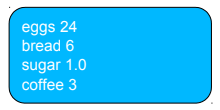

## Programming Fundamentals, Class 08

###### this is an adaptation of the materials provided by Professor João Manuel de Oliveira e Silva Rodrigues


### Summary

* Dictionaries


### Dictionaries

* A **dictionary** is an *unordered collection* of *unique, associative* items
  * **Collection** because it may contain zero or more items
  * **Unordered** because items are **not in sequence** from first to last
  * **Associative** because each item **associates a key to a value**
  * **Unique** because no two items can have the same key
* Dictionaries are also called **associative arrays** or **maps**
  * Because they establish a *mapping* between keys and values
* Dictionary items are also called **key-value pairs**


### Creating and Accessing Items

* A dictionary may be created using braces (curly brackets):

```python
eng2sp = {'one':'uno', 'two':'dos', 'three':'tres'}
shop = {'eggs':12, 'sugar':1.0, 'coffee':3}
```


* An empty dictionary may be created with `{}` or `dict()`
* To access the value for a given key, use square brackets:

```python
shop['sugar']	#-> 1.0
eng2sp['two']	#-> 'dos'
```


* Dictionaries are **mutable**

```python
shop['eggs'] = 24	#-> Change the value for a key
shop['bread'] = 6	#-> Add a new key-value association
```


### Value and Key Types

* **Values** in a dictionary can be of any type:

```python
shop['eggs'] = [1,'a']
shop['bread'] = {'brown':6, 'white':[2,3]}
```


* **Keys** may be ints, floats, strings, tuples or essentially any other **immutable** objects. So, lists are not valid keys!

```python
eng2sp[4] = 'quatro'	 #-> integer key is fine
d[[1,2]] = 'A'			 #-> TypeError: unhashable type
d[(12,25)] = 'Christmas' #-> tuple key is fine
```


* Actually, keys must be **hashable**. In practice, this means:
  * keys must be immutable scalars, or
  * immutable collections containing only hashable elements: `d[(1,[2,3])] = 'quatro' #-> TypeError: unhashable type`


### Dictionaries *versus* Lists

* When accessing items, a dictionary is a kind of generalized list. In a list, the indexes are integers. In a dictionary, keys can be any type of object (almost):

```python
lst = [50,51,52]
dic = {'um':1, 'vinte':20, 'mil':1000}
lst[1]		#-> 51
dic['mil']	#-> 1000
```


* However, the order of items in a dictionary is irrelevant and unpredictable:

```python
{'a':1, 'b':2} == {'b':2,'a':1}	#-> True
d = {10:'dez', 20:'vinte', 1000: 'mil'}
print(d)						#-> {1000: 'mil', 10:'dez', 20:'vinte'} 
```


* Also, you cannot take slices from dictionaries: `d[10:20] #-> TypeError`


### Dictionary Methods

* The `len` function returns the number of key-value pairs
* The `in` operator tells you whether something appears as a key in the dictionary (**fast**!):

```python
'two' in eng2sp	#-> True ('two' is a key)
'uno' in eng2sp	#-> False ('uno' is a key)
```


* Three methods return sequences of keys, values and items:

```python
d.keys()	#-> [1000,10,20]
d.values()	#->['mil', 'dez', 'vinte']
d.items()	#->[(1000,'mil'), (10,'dez') (20,'vinte')]
```


* So, to see whether something is a value in the dictionary, you could use (but this is **slow**): `'uno' in eng2sp.values() #-> True`
* Trying to access an inexistent key is an error:

```python
d[10]	#-> 'dez'
d[33]	#-> KeyError
```


* But using the get method will return a default value:

```python
d.get(10)	#-> 'dez'
d.get(33)	#-> None
d.get(33, 'oops')	#-> 'oops'
```


* We can delete an item with the `del` operator:

```python
del d[20]
print d	#-> {1000: 'mil', 10: 'dez'}
```


* Or use pop to delete an item and return its value:

```python
x = d.pop(10)	#-> x == 'dez'
print(d)		#-> {1000:'mil'}
```


### Dictionary Traversal

* The `for` instruction may be used to traverse dictionary *keys*:

```python
shop = {'eggs':24, 'bread':6,'coffee':3,'sugar':1.0}
for k in shop:
    print(k, shop[k])
```



* This is equivalent to:

```python
for k in shop.keys():
    print(k,shop[k])
```


* We may also traverse (key, value) pairs directly:

```python
for k,v in shop.items():
    print(k,v)
```


### Updating Dictionaries

* Many applications require updating a dictionary one item at a time
* This can be done in several alternative, but equivalent ways:

```python
#A
d = {}
for c in message:
    if c not in d:
        d[c] = 1
    else:
        d[c] += 1
        
#B
d = {}
for c in message:
    if c not in d:
        d[c] = 0
    d[c] += 1

#C
d = {}
for c in message:
    d[c] = d.get(c,0) + 1

#D
d = {}
for c in message:
    d.setdefault(c,0)
    d[c] +=1
```


### Dictionaries and Lists of Tuples

* Dictionaries have a method called items that returns a sequence of tuples, where each tuple is a key-value pair:

```python
d = {'a':0,'b':1,'c':2}
t = d.items()	#-> dict_items(('a',0),('c',2),('b',1))
```


* We can use a list of tuples to initialize a new dictionary:

```python
t = [('a',0), ('c':2), ('b',1)]
d = dict(t)	#-> {'a':0,'c':2,'b':1}
```


* Combining items, tuple assignment and for:

```python
for key, val in d.items():
    print(val,key)
```

