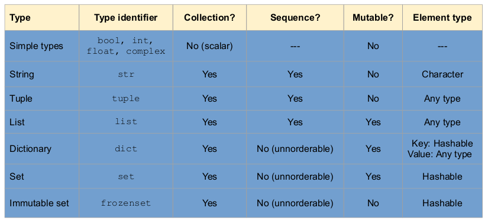

## Programming Fundamentals, Class 09

###### this is an adaptation of the materials provided by Professor João Manuel de Oliveira e Silva Rodrigues


### Summary

* Sets


### Set Types

* A **set** is an *unordered collection* of *unique* items
  * **Collection** because it may contain zero or more elements
  * **Unordered** because elements are **not in sequence**
  * **Unique** because elements may **not be repeated**
* Sets are a fundamental data type in Math and computing
* In Python, a set may be created using braces:

```python
fruits = {'pear','apple','banana','orange'}
s = {x for x in fruits if x<'c'}	# by comprehension!
```


* The `set` constructor converts from other types: `numbers = set([3,1,3]) #-> {1,3}`
* The empty set must be created with `set()`, because `{}` is a dictionary: `empty = set()`


### Elements in a Set are Unique

* An object either is or is not in a set. It cannot be in the set more than once:

```python
{1,2,1} == {1,2}	#-> True
len({4,5,4,5,5})	#-> 2
```


* Like *keys* in a dictionary
* Unlike sequences: `[1,2,1] == [1,2] #-> False`
* A common application of sets is for eliminating duplicate elements in sequences:

```python
set([1,2,2,2,1])	#-> {1,2}
set('banana')		#-> {'a','b','n'}
```


* This eliminates order too


### Elements in a Set are Unordered

* Sets don't recall the position or order of entry of elements:

```python
s = {3,1,2}
s						#-> {1,2,3}
s == {2,3,1} == {1,2,3}	#-> True
```


* So, indexing, slicing, concatenation are **not allowed**:

```python
s[0]	# TypeError
s[0:2]	# TypeError
s + {4}	# TypeError
```


### Elements in a Set Must be Hashable

* A set may contain elements of various types, but only *hashable* types are allowed
* Just like dictionary ***keys***
* Simple immutable types (like numbers) are **OK**
* Strings and tuples (if their elements are *hashable*) are **OK**, too: `{ 23, 'eggs', (1997,10,23) }`
* Lists, dictionaries, sets and other mutable types are **not allowed**:

```python
{ [1,2] }		# TypeError
{ {1}, {1,2} }	# TypeError
```


### Operations on Sets

* Sets have a length and support the membership operator:

```python
s = {23, 5, 12}	
len(s)			# 3
5 in s			# True (This is a fast operation!)
```


* Sets support intersection, union, set subtraction:

```python
{3,4,5} & {1,2,3}	#-> {3}
{3,4,5} | {1,2,3}	#-> {1,2,3,4,5}
{3,4,5} - {1,2,3}	#-> {4,5}
{3,4,5} ^ {1,2,3}	#-> {1,2,4,5}
```


* Sets may be compared for equality: `{2,2,1} == {1,2}	# True`

* We may test subset or superset relations:

```python
s = {1,2}
s <= {1,2,3}	# True = s.issubset({1,2,3})
s < {1,2}		# False
s >= {2}		# True = s.issuperset({2})
s > {2}			# True
```


* But this is **not** a *total ordering* relation! You can have two sets A and B such that: `A<B, A==B, A>B # All are False!`

  

### Sets are Mutable

* We can add or remove elements in sets:

```python
s = {1,2,3}	
s.add(4)	# s -> {1,2,3,4}
s.remove(2)	# s -> {1,3,4}
```


* We can update the set by union, intersection or differences:

```python
s |= {3,5,7}		# s -> {1,3,4,5,7}
s.update({3,5,7})	# same thing
s &= {1,2,3,4}		# s -> {1,3,4}
s -= {4,5,6}		# s -> {1,3}
s^= {1,2,4}			# s -> {2,3,4}
```


* Python also has immutable sets: the `frozenset` type - `T = frozenset({1,2,3})`


### How to Select the Proper Data Type?

* Choosing the right type to store your data is very important
* First, consider the different **characteristics** of the types

 


### Some Questions to Help Deciding

* Are the data simple (scalar) or compound (several elements)?
  * Compound => collection
* Does element order/position matter?
  * Yes => sequence
* Will the contents grow, shrink or change?
  * Yes => mutable
* Need to quickly map a key to a value?
  * Yes => dictionary
