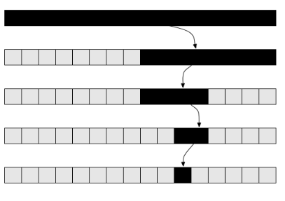

## Programming Fundamentals, Class 11

###### this is an adaptation of the materials provided by Professor João Manuel de Oliveira e Silva Rodrigues


### Summary

* Sequential and Binary Search
* Sorting
* Functions as Arguments
* Lambda Expressions


### Searching

* Searching for an element X in a list L (or some other sequence) is a common operation in many problems
  * Sometimes we just need to check **if** the element is there. In Python, we can do this with: `x in l`
  * Other times we need to know where it is. In Python, we can do this with: `l.index(x)`
* These operations are simple, but they can be **slow**: it takes time (and energy) to search a very large list


### Sequential Search

* A **sequential search** scans a sequence from start to end (or from the end to start):

```python
def seqSearch(lst,x):
    """Return k such that x == lst[k], or None if no such k."""
    for i in range(len(lst)):
        if x == lst[i]:
            return i
    return None
```


* This is what the `index` method and the `in` operator do
* Finding an element in a list of length n requires up to n comparisons


### Binary Search

* If the **sequence is sorted**, `l[0] <= l[1] <= ... <= l[-1]`, then there's a much better way to search
  1. Compare x to the element in the middle of l
  2. If x is smaller, search only in the first half of l
  3. If x is larger, search only in the last half 

* This is the **binary search** algorithm

   

* Binary search for exact match (stops when equal):

```python
def binSearchExact(lst,x):
    """Find k such that x == lst[k] (or None if no such k)."""
    first = 0			# first index that could be solution
    last = len(first)	# first index that cannot be solution
    while first < last:
        mid = (first+last)//2
        if x < lst[mid]:
            last = mid
        elif x > lst[mid]:
            first = mid+1
        else:
            return mid
    return None
```


* This works exactly like `seqSearch`, but is **much faster**
* With a minor modification, we can make it slightly faster
* Binary search equivalent to `bisect.bisect_left`

```python
def binSearch(lst,x):
    """Find k such that: lst[k-1] < x <= lst[k] (not quite!)"""
    first = 0			# first index that can be result
    last = len(lst)		# last index that can be result
    while first < last:
        mid = (first+last)//2
        if x <= lst[mid]:		# just one comparison inside loop!
            last = mid
        else:
            first = mid+1
    return first
```


* If x is not found, still returns index k of where x should be
* If k<len(lst) and x == lst[k], then we know x was found
* This is slightly faster, in general


### Sorting

* A sorted sequence is much faster to search
* Sorting is putting the elements of a sequence in order
* In Python, use the `sorted` function or the `sort` method:

```python
l.sort()		# modifies list l in-place
l2 = sorted(l)	# creates l2 - l is not modified!
```


* `sorted` returns a list, but takes any kind of collection:

```python
sorted('bananas')	#-> ['a','a','a','b','n','n']
n = [9,7,2,8,5,3]
print(sorted(n))	#-> [2,3,5,7,8,9]
l = ['maria','carla','anabela','antonio','nuno']
print(sorted(l))	#-> ['anabela','antonio','carla','maria','nuno']
```


### Sorting Criteria

* These functions can sort by different **criteria**:

```python
l = ["Mario","Carla","anabela","Maria","nuno"]
print(sorted(l))				# (lexicographic sort) -> ['Carla','Maria','Mario','anabela','nuno']
print(sorted(l,key=len))		# (sort by length) -> ['nuno','Mario','Carla','Maria','anabela']
print(sorted(l,key=str.lower))	# (case-insensitive) -> ['anabela','Carla','Maria','Mario','nuno']
```


* The optional `key` argument receives a **function** to sort the elements by
* The `key` function is applied to each element and the results are compared to establish the order
* To reverse the order, use the `revert = True` argument


### Sorting Complex Data

* Lists of tuples can be sorted, too:

```python
dates = [(1910,10,5,'Republic'),(1974,4,25,'Liberty'),(1640,12,1,'Independence')]
print(sorted(dates))	# 'lexicographic' order
```


* Tuples are compared like strings: left-to-right
* For a different order, use the key argument:

```python
sorted(dates,key=lambda t: t[3])			# by name
sorted(dates, key=lambda t: t(t[1],t[2]))	# by month,day
```


* We're using ***lambda expressions*** here


### Lambda Expressions

* **Lambda expressions** define simple anonymous functions:

```python
sq = lambda x: x**2	# Same as def sq(x): return x**2
sq(5)				#-> 25
add = lambda x,y: x+y
```


* The result must be an expression - no statements allowed
* Should only be used for simple functions
* They're useful to pass as arguments (such as `key=...`)


### Insertion Sort

* There are lots of sorting algorithms - one of the simplest is called insertion sort:
  1. Assume the first k algorithms are sorted. l[k] is not
  2. Save l[k] in t
  3. Move every l[j]>t to l[j+1], starting from j=k-1 down
  4. Put t into the vacant slot
  5. Now, increment k and repeat
