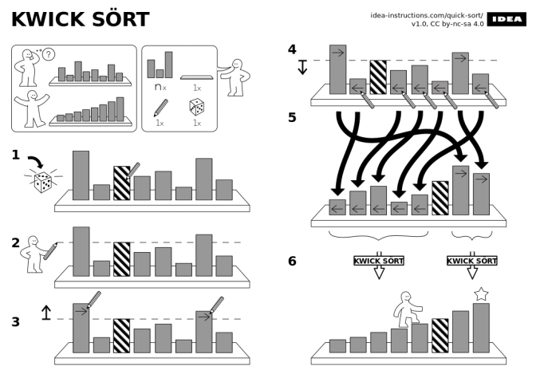

## Programming Fundamentals, Class 12

###### this is an adaptation of the materials provided by Professor João Manuel de Oliveira e Silva Rodrigues


### Summary

* Recursive Functions
* Examples


### A Crazy Idea

* What does this function do?

```python
def sumsq(lst):
    s = 0
    for x in lst:
        s += x**2
	return s

sumsq([1,2,3])	#-> 14
```


* Does this work on an empty list? 

* Check out this weird version

```python
def sumsq2(lst):
    s = 0
    if len(lst) > 0:
        sq0 = lst[0] ** 2
        s = sq0 + sumsq(lst[1:])
	return s
```


* It squares the first element;

* Calls `sumsq` on the rest;

* And adds;

* For empty lst, just return zero.

  

* It is **equivalent** to `sumsq` in every case, but still calls the original `sumsq` - not very useful
  
* But if `sumsq2 <=> sumsq`, why not **call itself**?


### Recursive Functions

* This is what would result:

```python
def sumsqR(lst):
    s = 0
    if len(lst) > 0:
        sq0 = lst[0]**2
        s = sq0 + sumsqR(lst[1:])
    return s
```


* This is a recursive function: a function that calls itself
* Notice that there is no loop instruction, but code gets executed several times, anyway
* How does this work?


### How Recursion Works

* What happens when we call `sumsqR([1,2,3])`?
* Notice that at one point, there are 4 frames in memory
  * 4 variables named `lst`, 4 named `s`, 3 named `sq0`, but all distinct!
* The frames are stored in the **program stack**


### Example: Towers of Hanoi

* The Towers of Hanoi puzzle (Édouard Lucas, 1883)
* Move tower from A to C, using B temporarily
  * Move only one disk at a time;
  * No disk may be put on top of a small disk


### Example: Quicksort

* The quicksort algorithm (C.A.R Hoare) goes like this:
  1. Pick one of the values in the list (generally the first) and store in T
  2. Put values smaller than T into a list L1, the others into a list L2
  3. Sort L1 and L2 (using same algorithm, by the way)
  4. Result is L1 + [T] + L2
* Of course, there's a few more details (the base case):

```python
def qsorted(lst):
    if len(lst)<=1:		# no need to sort
        return lst[:]
    T = lst[0]
    L1 = [x for x in lst[1:] if x<T]
    L2 = [x for x in lst[1:] if x>=T]
    return qsorted(L1) + [T] + qsorted(L2)
```


* This is simple to understand and quite efficient




### The Rules of Recursion Termination

* To guarantee that a recursive function **terminates**, it must obey some **rules**

1. There must be cases that can be solved *without* recursive calls - these are called the **base cases** much better way to search
2. In the other cases, the *context passed* to recursive calls **must always differ** from the *context received*
3. In successive recursive calls, the context must **converge** towards the base case


### Recursion vs. Repetition

* Any problem that can be solved by repetition may be solved by recursion, and vice-versa
* For certain complex problems, recursive solutions are usually more concise and easier to understand
* Recursive implementations may incur some time and memory costs because of function calls and stack usage
* If the problem has a simple iterative solution, that is usually the most efficient, too


### Writing Recursive Functions 

* To develop a recursive function to solve some problem, there are some tricks that help

1. Start by defining the **arguments** you need, what they **mean**, and the **result** you **expect**, are *rigorously* as possible
2. Now, **assume** the function will work. Describe how the solution to a problem can be obtained from the solutions of **smaller** versions of the problem. This will be the recursive part of the algorithm
3. Finally, determine what are the **base cases**: which conditions have a trivial solution? This will be the non-recursive part of the algorithm **(hint:** usually, base cases are conditions outside the *domain* when of the recursive part)

* While in step 2, you may realize that you need extra arguments - just add them and go back to step 1
