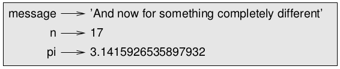

## Think Python  :snake:


### The Way of the Program


#### 1. The Python programming language

The most important skill for a computer scientist is **problem solving**: the ability to formulate problems, think creatively about solutions and express a solution clearly and accurately.

**Python is a high-level language**, just like C, C++ and Java. Because computers can only run programs written in **low-level languages**, also called "machine language" or "assembly language", programs in high-level languages need to be processed before they can run. This takes some time, which is a small disadvantage of high-level languages. The advantages are readability (they are much easier to write, read and understand), compactness and **portability** (they can run on different kinds of computer with little or no modifications). 

Two kinds of programs process high-level languages: the **interpreter** and the **compiler**. An interpreter reads the program line by line, executing the commands as they appear. A compiler, however, reads the whole program and fully translates it before the program runs. In this case, the high-level program is called the **source code** and the translated program is called the **object code**, or **executable**.

Python is considered an interpreted language because programs in this language are executed by an interpreter. There are two ways to use the interpreter: **interactive mode** and **script mode**. In interactive mode, a **prompt** appears indicating that the interpreter is ready to receive a Python instruction. After the insertion, the interpreter displays the result. Another way to run Python is to store the code in a file and use the interpreter to execute the contents of a file, which is called a **script**: `python3 filename.py`.


#### 2. What is a program?

A **program** is a sequence of instructions that specifies how to preform a computation, which can be something mathematical (solving a system of equations, finding the roots of a polynomial,...) or something symbolic (searching or replacing text in a document, even compiling a program!,...). 

However complex a program is, every program you have used is made up of: input, output, math, conditional execution and repetitions. So, programming is breaking complex tasks into smaller, simpler subtasks that can be solved using one (or more) of the above five basic instructions - an **algorithm**. 


#### 3. What is debugging?

Programming is error-prone. Programming errors are called **bugs**, and the process of tracking them down is called **debugging**. Three kinds of errors can occur when writing a program: syntax errors, runtime errors and semantic errors.

**Syntax** is the structure of a program and the rules about that structure. Python can only execute a program if its syntax is correct, otherwise the interpreter will display an error message and quit. For example, in Python, parenthesis have to come in matching pairs, so `(1+2)` is legal but `8)` is a **syntax error**.  

The second type of error is a runtime error, also called **exception** because it usually indicates that something exceptional (and bad) has happened, that does not appear until after the program has started running. These are rare to encounter in simple programs. 

**Semantics** refer to the meaning of a program. If there is a semantic error in a program, the program will still run, but it will not do what the programmer wanted it to do. It will do what it was told to do - which can be different. Identifying semantic errors can be tricky because it requires you to work backward by looking at the output of the program and trying to figure out what it is doing.


#### 3. What is debugging?

**Natural languages** are the ones that people speak, such as Portuguese, or English, that weren't designed by people, but rather evolved naturally. On the contrary, **formal languages** are designed by people for specific applications. Mathematical notation, for example, is a formal language that is particularly good at denoting relationships among number and symbols. Programming languages are formal languages that have been designed to express computations.

Formal languages tend to have strict rules about syntax. One type of syntax rules are regarding to **tokens**, the basic elements of the language, such as words or numbers. The mathematical statement `3 + 3 = $6`  is incorrect because `$` is not a legal token in mathematics. The other type if syntax rules regards the structure of the statement: `3 + = 3` is illegal because even though `+` and `=` symbols are legal tokens, they can't be used one right after the other (in mathematics, not programming! :wink: ). Figuring out the structure of a statement is called **parsing**.


#### 5. The first program

Traditionally, the first program one writes in a new language is a program that only prints "Hello, World!". In Python 3, it looks like this:

```python
print("Hello, World!")
```

The **print statement** is a function that displays a value on the screen. The quotation marks mark the beginning and the end of the function argument, and do not appear in the result.


#### 6. Solved Exercises

##### Exercise 1.1 - Write a well-structured English sentence with invalid tokens in it. Then write another sentence with all valid tokens but with invalid structure.

* Í like the sün. (Í and ü are not valid tokens in English but "I like the sun" is a well-structured sentence)
* Sun me likes. (all valid tokens but invalid structure)

##### Exercise 1.4 - If you run a 10 kilometer race in 43 minutes 30 seconds, what is your average time per mile? What is your average speed in miles per hour? (Hint: there are 1.61 kilometers in a mile)

```python
>>> 43*60 + 30 # 10 km time in seconds
2610
>>> 2610*1.61 / 10 # 1 mile time in seconds
420.21000000000004
>>> 420.21 / 60 # 1 mile time in minutes 
7.0035
```


### Variables, Expressions and Statements


#### 1. Values and Types

A **value** is one of the basic units of a program. There are different **types** of values: `2` is a whole number, an **integer**, so its type is `int`;  `2.5` is a number with a fractional part but its type is called `float` because these numbers are represented in a format called **floating-point**; and `"Hello, World!"` is a `string`, because it contains a **"string"**  (sequence) of letters. If you are not sure what type a value has, the interpreter can tell you:

```python
>>> type('Hello, World!')
<type 'str'>
>>> type(17)
<type 'int'>
```


#### 2. Variables

One of the most powerful features of a programming language is the ability to manipulate variables. A **variable** is a name that refers to a value. An **assignment statement** creates a new variable and gives it a value:

```python
>>> message = 'And now for something completely different'
>>> n = 17
>>> pi = 3.1415926535897932
```


A common way to represent variables on paper is to write the name with an arrow pointing to the variable’s value. This kind of figure is called a **state diagram** because it shows what state each of the variables is in:




#### 3. Variable names and keywords

To improve readability, variable names are usually chosen so that they can represent what that variable is used for. Variable names can have any number of characters and can contain letters, numbers and underscores (`_`), but they must begin with a letter. It is legal to use uppercase letters, but it is a good idea to begin variable names with a lowercase letter. 

Variable names must not be keywords. **Keywords** are special words used by the interpreter to recognize the structure of the program. Python 3 has 31 keywords:

> and			continue		 except		  if			   	 nonlocal	 	raise			yield
>
> as		   	def			  	 finally	 	  import	 	 not			  	 return
>
> assert		del			   	for 	 		   in			  	 or					try
>
> break	 	elif			   	from	   	  is			  	  pass				while
>
> class		  else				  global		   lambda		 print				with


#### 4. Operators and operands

**Operators** are special symbols that represent computation. The values the operator is applied to are called **operands**.

| Computation    | Operator |
| -------------- | -------- |
| Addition       | +        |
| Subtraction    | -        |
| Multiplication | *        |
| Division       | /        |
| Exponentiation | **       |
| Floor Division | //       |


In Python 3, the result of a division of numbers, even if one or both of the operands or even the result are integers, is a float. **Floor division**, on the contrary, chops off the fraction part, so it only remains the integer part.


#### 5. Expressions and statements

An **expression** is a combination of values, variables and operators. A **statement** is a unit of code that the Python interpreter can execute, including expressions.


#### 6. Interactive mode and script mode

In script mode, an expression, all by itself, has no visible effect. Python actually **evaluates** the expression (retrieves a value by performing the operations on the expression), but it doesn’t display the value unless it is told to. In interactive mode, however, an expression's value is printed. 


#### 7. Order of operations

When more than one operator appears in an expression, the order of evaluation depends on the **rules of precedence**. For mathematical operators, Python follows mathematical convention (**PEMDAS** acronym).


#### 8. String operations

The `+` operator on strings preform **concatenation**, which means joining the strings by linking them end-to-end. For example: `'well' + 'behaved' = 'wellbehaved'`.

The `*` operator also works on strings, preforming repetition. For example: `'good'*3 = 'goodgoodgood'`.


#### 9. Comments

Sometimes, it is a good idea to add notes to a program, to explain them in natural language. These notes are called **comments** and they start with the `#` symbol.  Everything from the `#` to the end of the line is ignored - it has no effect on the program.


#### 10. Exercises


##### Exercise 2.1 - Type the following statements in the Python interpreter to see what they do:

```python
>>> 5
5
>>> x = 5
>>> x + 1
6
```

##### Exercise 2.2 - Assume that we execute the following assignment statements:

```python
width = 17
height = 12.0
delimiter = '.'
```

##### For each of the following expressions, write the value of the expression and the type (of the value of

the expression):

```python
width/2			# 8.5 type float
width/2.0		# 8.5 type float
height/3		# 4 type float
1 + 2 * 5		# 11 type int
delimiter * 5	# '.....' type str
```

##### Exercise 2.3 - Practice using the Python interpreter as a calculator:

##### 1. The volume of a sphere with radius r is 4/3 πr³ . What is the volume of a sphere with radius 5? Hint: 392.7 is wrong!

```python
>>> 4/3*3.14*5**3
523.3333333333334
```

##### 2. Suppose the cover price of a book is $24.95, but bookstores get a 40% discount. Shipping costs $3 for the first copy and 75 cents for each additional copy. What is the total wholesale cost for

60 copies?

```python
>>> 24.95*0.6 + 3 + 0.75*59
62.22
```

##### 3. If I leave my house at 6:52 am and run 1 mile at an easy pace (8:15 per mile), then 3 miles at tempo (7:12 per mile) and 1 mile at easy pace again, what time do I get home for breakfast?

```python
>>> 2*8.25 + 3*7.2
38.1
```

**ans:** 5h52 + 0h38m06s = 6h30 am


### Functions


#### 1. Function calls

A **function** is a named sequence of statements which may or may not take arguments and may or may not produce ("return") a result, which is called a return value.


#### 2. Math functions

Python has a `math` module that provides most of the familiar mathematical functions, like `log` and `sin`. A **module** is a file that contains a collection of related functions. Modules can be used when **imported** first with the **import statement** `import math`. This statement creates a **module object** named "math", which contains the functions and variables defined in the module. 


, function definition, function object, header, body

parameter, function call, argument, local variable, return value

fruitful function, void function

 dot notation, composition

flow of execution, stack diagram, frame, traceback