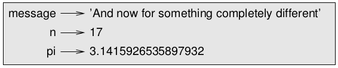
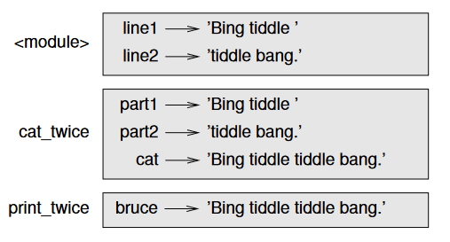
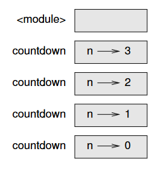
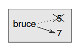

## Think Python  :snake: 


### :computer: The way of the program :computer:


#### 1. The Python programming language

The most important skill for a computer scientist is **problem solving**: the ability to formulate problems, think creatively about solutions and express a solution clearly and accurately.

**Python is a high-level language**, just like C, C++ and Java. Because computers can only run programs written in **low-level languages**, also called "machine language" or "assembly language", programs in high-level languages need to be processed before they can run. This takes some time, which is a small disadvantage of high-level languages. The advantages are readability (they are much easier to write, read and understand), compactness and **portability** (they can run on different kinds of computer with little or no modifications). 

Two kinds of programs process high-level languages: the **interpreter** and the **compiler**. An interpreter reads the program line by line, executing the commands as they appear. A compiler, however, reads the whole program and fully translates it before the program runs. In this case, the high-level program is called the **source code** and the translated program is called the **object code**, or **executable**.

Python is considered an interpreted language because programs in this language are executed by an interpreter. There are two ways to use the interpreter: **interactive mode** and **script mode**. In interactive mode, a **prompt** appears indicating that the interpreter is ready to receive a Python instruction. After the insertion, the interpreter displays the result. Another way to run Python is to store the code in a file and use the interpreter to execute the contents of a file, which is called a **script**: `python3 filename.py`.


#### 2. What is a program?

A **program** is a sequence of instructions that specifies how to preform a computation, which can be something mathematical (solving a system of equations, finding the roots of a polynomial,...) or something symbolic (searching or replacing text in a document, even compiling a program!,...). 

However complex a program is, every program you have used is made up of: input, output, math, conditional execution and repetitions. So, programming is breaking complex tasks into smaller, simpler subtasks that can be solved using one (or more) of the above five basic instructions - an **algorithm**. 


#### 3. What is debugging?

Programming is error-prone. Programming errors are called **bugs**, and the process of tracking them down is called **debugging**. Three kinds of errors can occur when writing a program: syntax errors, runtime errors and semantic errors.

**Syntax** is the structure of a program and the rules about that structure. Python can only execute a program if its syntax is correct, otherwise the interpreter will display an error message and quit. For example, in Python, parenthesis have to come in matching pairs, so `(1+2)` is legal but `8)` is a **syntax error**.  

The second type of error is a runtime error, also called **exception** because it usually indicates that something exceptional (and bad) has happened, that does not appear until after the program has started running. These are rare to encounter in simple programs. 

**Semantics** refer to the meaning of a program. If there is a semantic error in a program, the program will still run, but it will not do what the programmer wanted it to do. It will do what it was told to do - which can be different. Identifying semantic errors can be tricky because it requires you to work backward by looking at the output of the program and trying to figure out what it is doing.


#### 4. Formal and Natural Languages

**Natural languages** are the ones that people speak, such as Portuguese, or English, that weren't designed by people, but rather evolved naturally. On the contrary, **formal languages** are designed by people for specific applications. Mathematical notation, for example, is a formal language that is particularly good at denoting relationships among number and symbols. Programming languages are formal languages that have been designed to express computations.

Formal languages tend to have strict rules about syntax. One type of syntax rules are regarding to **tokens**, the basic elements of the language, such as words or numbers. The mathematical statement `3 + 3 = $6`  is incorrect because `$` is not a legal token in mathematics. The other type if syntax rules regards the structure of the statement: `3 + = 3` is illegal because even though `+` and `=` symbols are legal tokens, they can't be used one right after the other (in mathematics, not programming! :wink: ). Figuring out the structure of a statement is called **parsing**.


#### 5. The first program

Traditionally, the first program one writes in a new language is a program that only prints "Hello, World!". In Python 3, it looks like this:

```python
print("Hello, World!")
```

The **print statement** is a function that displays a value on the screen. The quotation marks mark the beginning and the end of the function argument, and do not appear in the result.


#### 6. Solved Exercises

##### Exercise 1.1 - Write a well-structured English sentence with invalid tokens in it. Then write another sentence with all valid tokens but with invalid structure.

* Í like the sün. (Í and ü are not valid tokens in English but "I like the sun" is a well-structured sentence)
* Sun me likes. (all valid tokens but invalid structure)

##### Exercise 1.4 - If you run a 10 kilometer race in 43 minutes 30 seconds, what is your average time per mile? What is your average speed in miles per hour? (Hint: there are 1.61 kilometers in a mile)

```python
>>> 43*60 + 30 # 10 km time in seconds
2610
>>> 2610*1.61 / 10 # 1 mile time in seconds
420.21000000000004
>>> 420.21 / 60 # 1 mile time in minutes 
7.0035
```


### :mega: Variables, expressions and statements :mega:


#### 1. Values and Types

A **value** is one of the basic units of a program. There are different **types** of values: `2` is a whole number, an **integer**, so its type is `int`;  `2.5` is a number with a fractional part but its type is called `float` because these numbers are represented in a format called **floating-point**; and `"Hello, World!"` is a `string`, because it contains a **"string"**  (sequence) of letters. If you are not sure what type a value has, the interpreter can tell you:

```python
>>> type('Hello, World!')
<type 'str'>
>>> type(17)
<type 'int'>
```


#### 2. Variables

One of the most powerful features of a programming language is the ability to manipulate variables. A **variable** is a name that refers to a value. An **assignment statement** creates a new variable and gives it a value:

```python
>>> message = 'And now for something completely different'
>>> n = 17
>>> pi = 3.1415926535897932
```


A common way to represent variables on paper is to write the name with an arrow pointing to the variable’s value. This kind of figure is called a **state diagram** because it shows what state each of the variables is in:




#### 3. Variable names and keywords

To improve readability, variable names are usually chosen so that they can represent what that variable is used for. Variable names can have any number of characters and can contain letters, numbers and underscores (`_`), but they must begin with a letter. It is legal to use uppercase letters, but it is a good idea to begin variable names with a lowercase letter. 

Variable names must not be keywords. **Keywords** are special words used by the interpreter to recognize the structure of the program. Python 3 has 31 keywords:

> and			continue		 except		  if			   	 nonlocal	 	raise			yield
>
> as		   	def			  	 finally	 	  import	 	 not			  	 return
>
> assert		del			   	for 	 		   in			  	 or					try
>
> break	 	elif			   	from	   	  is			  	  pass				while
>
> class		  else				  global		   lambda		 print				with


#### 4. Operators and operands

**Operators** are special symbols that represent computation. The values the operator is applied to are called **operands**.

| Computation    | Operator |
| -------------- | -------- |
| Addition       | +        |
| Subtraction    | -        |
| Multiplication | *        |
| Division       | /        |
| Exponentiation | **       |
| Floor Division | //       |


In Python 3, the result of a division of numbers, even if one or both of the operands or even the result are integers, is a float. **Floor division**, on the contrary, chops off the fraction part, so it only remains the integer part.


#### 5. Expressions and statements

An **expression** is a combination of values, variables and operators. A **statement** is a unit of code that the Python interpreter can execute, including expressions.


#### 6. Interactive mode and script mode

In script mode, an expression, all by itself, has no visible effect. Python actually **evaluates** the expression (retrieves a value by performing the operations on the expression), but it doesn’t display the value unless it is told to. In interactive mode, however, an expression's value is printed. 


#### 7. Order of operations

When more than one operator appears in an expression, the order of evaluation depends on the **rules of precedence**. For mathematical operators, Python follows mathematical convention (**PEMDAS** acronym).


#### 8. String operations

The `+` operator on strings preform **concatenation**, which means joining the strings by linking them end-to-end. For example: `'well' + 'behaved' = 'wellbehaved'`.

The `*` operator also works on strings, preforming repetition. For example: `'good'*3 = 'goodgoodgood'`.


#### 9. Comments

Sometimes, it is a good idea to add notes to a program, to explain them in natural language. These notes are called **comments** and they start with the `#` symbol.  Everything from the `#` to the end of the line is ignored - it has no effect on the program.


#### 10. Solved Exercises

##### Exercise 2.1 - Type the following statements in the Python interpreter to see what they do:

```python
>>> 5
5
>>> x = 5
>>> x + 1
6
```

##### Exercise 2.2 - Assume that we execute the following assignment statements:

```python
width = 17
height = 12.0
delimiter = '.'
```

##### For each of the following expressions, write the value of the expression and the type (of the value of

the expression):

```python
width/2			# 8.5 type float
width/2.0		# 8.5 type float
height/3		# 4 type float
1 + 2 * 5		# 11 type int
delimiter * 5	# '.....' type str
```

##### Exercise 2.3 - Practice using the Python interpreter as a calculator:

##### 1. The volume of a sphere with radius r is 4/3 πr³ . What is the volume of a sphere with radius 5? Hint: 392.7 is wrong!

```python
>>> 4/3*3.14*5**3
523.3333333333334
```

##### 2. Suppose the cover price of a book is $24.95, but bookstores get a 40% discount. Shipping costs $3 for the first copy and 75 cents for each additional copy. What is the total wholesale cost for

60 copies?

```python
>>> 24.95*0.6 + 3 + 0.75*59
62.22
```

##### 3. If I leave my house at 6:52 am and run 1 mile at an easy pace (8:15 per mile), then 3 miles at tempo (7:12 per mile) and 1 mile at easy pace again, what time do I get home for breakfast?

```python
>>> 2*8.25 + 3*7.2
38.1
```

**ans:** 5h52 + 0h38m06s = 6h30 am


### :red_circle: Functions :red_circle:


#### 1. Function calls

A **function** is a named sequence of statements which may or may not take arguments and may or may not produce ("return") a result, which is called a **return value**.


#### 2. Type-conversion functions

Python provides built-in functions that convert values from one type to another, just like the `int` function that takes any value and tries to convert it to an integer: `int("32")`.


#### 3. Math functions

Python has a `math` module that provides most of the familiar mathematical functions, like `log` and `sin`. A **module** is a file that contains a collection of related functions. Modules can be used when **imported** first with the **import statement** `import math`. This statement creates a **module object** named "math", which contains the functions and variables defined in the module. 


#### 4. Compositions

One of the most powerful features of programming languages is their ability to take small
programming elements such as variables, expressions and statements, and **compose** them into a useful program. For example, the argument of a function can be an expression including arithmetic operators.


#### 5. Adding new functions

In Python, a programmer can create their own functions. `def` is a keyword that indicates a **function definition**. A function definition specifies the name of a new function (which can only contain letters, numbers and _, but the first character can't be a number) and the argument it takes inside the parentheses. This is called the function **header**, and ends with a colon.

The function definition also specifies the sequence of statements that execute when the function is called - which is indented (by convention with four spaces) and is called the function **body**. 

Once the function is defined, its name then represents a **function object**, which is of the type 'function' and it can be **called** everywhere inside its scope, even inside other functions or itself, by writing its name and, if necessary, its **arguments** inside the parentheses.


#### 6. Definitions and uses

Function definitions get executed just like other statements, but the effect is to create function objects. The statements inside the function do not get executed until the function is called, so the function definition generates no output. So a function needs to be created (defined) before it can be executed (called). 

##### Exercise 3.1 - Move the last line of this program to the top, so the function call appears before the definitions. Run the program and see what error message you get

```python
Traceback (most recent call last):
  File "think-python.py", line 14, in <module>
    repeat_lyrics()
NameError: name 'repeat_lyrics' is not defined
```


#### 7. Flow of execution

To ensure that the function is defined before it is executed, it is important to know the **flow of execution**, which is the order in which the statements will be executed. Execution always begins from the top of the program to the bottom, one statement at a time. A function call, however, takes the flow of execution on a detour, jumping to the bottom of the function, executing all the statements there, and them coming back to pick up where it left off. When the flow reaches the end of the program, the latter terminates.


#### 8. Parameters and arguments

Inside a function, its arguments are assigned to variables called **parameters**. The name of the variable passed as an argument in the function call has nothing to do with the name of the parameter the function internally converts it to.


#### 9. Variables and parameters are local

When a variable is created inside a function, it is a **local variable**, meaning that it only exists inside the function. If it is called elsewhere, the program won't be able to call it. This is the case with function parameters.


#### 10. Stack diagrams

To keep track of which variables can be used where, it is sometimes useful to draw a **stack diagram**, which shows the value of each variables but also to which function each variable belongs to. Each function is represented by a **frame**, which is a box with the name of the function beside it and the parameters and variables of the function inside it, just like in the following figure: 




The stack in which the frames are arranged indicates which function called which. If an error occurs during a Python program execution, Python prints the name of the function in which the error occurs and the function that called it, and so on, all the way back to main. This list of functions is called a **traceback**. 


#### 11. Fruitful functions and void functions

Some functions yield results; for lack of a better name, the author calls them **fruitful functions**. Other functions perform an action but don’t return a value. They are called **void functions**. In fruitful functions, one almost always wants to assign the result of the function to a variable and operate over it. In script mode, contrary to interactive mode, if a fruitful function is called on its own, the value is lost!  On the contrary, since void functions don't return a value, if they are assigned to a variable, it gets a special value of type `None`.


#### 12. Why functions?

Functions result in grouping several statements and naming them - making the program easier to read and debug. Functions also make a program smaller by eliminating repetitive code, which enhance maintainability. Functions can also be reused in other programs.


#### 13. Importing with `from`

Python provides two ways to import modules. One of them is: `import math`. This retrieves a module object, in this case named `math`, which contains constants (like `pi`) and functions (like `sin` and `exp`). To use these, one must write it in **dot notation** - the name of the module + dot + the name of the constant/function: `math.pi`.

As an alternative, one can import an object directly from a module: `from math import pi`. Or one can use the star operator to import everything from the module: `from math import *`. 

This way the code can be more concise, but be careful of naming conflicts between imported objects' names and the names of variables/functions in the program.


### :mag: Case study: interface design :mag:


#### 1. Turtle

Turtle is a module that provides a set of functions for drawing lines around the screen. It can be used by importing it: `from turtle import *`. Then, we need to create an **instance** of a Turtle to guide around, and assign it to the variable "bob": `bob = Turtle()` . An instance means a member of a set of objects of the same type - in this case, the type Turtle.


#### 2. Simple repetition

A turtle can, for example, draw a square. One can do this by inserting a statement which makes the turtle draw forward - `bob.forward(100)` - and a statement to turn the turtle around in a square angle - `bob.left(90)` - in a `for` **loop**. It is called a loop because the flow of execution runs through the body of this statement and then loops back to the top and runs it again until the initial conditions aren't met.


#### 3. Encapsulation

Wrapping a piece of code in a function is called **encapsulation**. This allows the naming of a block of code, which can be re-use, making the code more concise than writing the code twice.


#### 4. Generalization

Adapting a function to receive more parameters makes it more general, that's why it's called **generalization**. Because a function with many arguments can become confusing, it is legal and sometimes helpful for readability to include the names of the arguments in the function call. In that case, they are called keyword arguments, and the syntax is as follows: `polygon(bob, n=7, length=70)`.


#### 5. Interface design

The **interface** of a function is a summary of how it is used: what are the parameters? What
does the function do? And what is the return value? An interface is “clean” if it is “as
simple as possible, but not simpler. (Einstein)”


#### 6. Refactoring

**Refactoring** is the process of rearranging a program to improve function interfaces and facilitate reutilization of the code. This often happens because problem comprehension increases while developing a problem and the solution one saw fitted at the beginning may not be considered the best one after getting to know the problem better.


#### 7. A development plan

A **development plan** is the process of writing programs. One of the processes is often "encapsulation and generalization".  The steps are:

1. Start by writing a small program with no function definitions.
2. Once you get the program working, encapsulate it in a function and give it a name.
3. Generalize the function by adding appropriate parameters.
4. Repeat steps 1–3 until you have a set of working functions. Copy and paste working code to avoid retyping (and re-debugging).
5. Look for opportunities to improve the program by refactoring. For example, if you have similar code in several places, consider factoring it into an appropriately general function.

Despite its drawbacks, this process can be useful by allowing the programmer to design the program while coding it.


#### 8. docstring

A **docstring** is a string at the beginning of a function that explains the interface (“doc” is short for “documentation”). In Python, for this we use multiline strings (triple quotes), with a concise explanation of the function's behaviour and its parameters. This kind of documentation is important because if an interface design is hard to explain, it probably needs improving.

​     

###  :twisted_rightwards_arrows: Conditionals and recursion :repeat:


#### 1. Modulus operator

The **modulus operator** works on integers and takes the value of the remainder when the first operand is divided by the second. In Python, it is represented as a percentage sign (%) and it is used between the two integers. 


#### 2. Boolean expressions

A ***boolean* expression** is an expression that takes the values of either `True` or `False`, special values that belong to the type `bool`. These values result, for example, of **relational operators**, like `==`, which compare values. 


#### 3. Logical operators

There are three **logical operators**: `and`, `or` and `not`. `and` is true only if both evaluated conditions are true. `or` is true if either one of the conditions is true. `not` takes the opposite value of the evaluated *boolean* expression.


#### 4. Conditional execution

**Conditional statements** allow the program to change its behaviour depending on some evaluated **condition(s)**. The simplest form of doing this is the `if` statement. This statement has a header (if + condition + semicolon) followed by an indented body. Statements like this are also called **compound statements**. There is no limit for the number of statements in the body, but there has to be at least one. If we have nothing to write there (yet), we can use the `pass` statement.


#### 5. Alternative execution

The if statement can also have a second possible behaviour, in case the first condition is false. This is called **alternative execution** and uses the `else:` syntax. One of the two alternatives (**branches**) is always going to be executed.


#### 6. Chained conditionals

If there are more than two possibilities, more than two branches are needed. So, it is used the **chained conditional** `elif`, which is an abbreviation of "else, if". After `elif`, there is another expression to be evaluated, and then an indented body. There can be unlimited `elif` statements, and the optional `else` statement should always appear at the end. Even if more than one condition is true, only the first true branch executes.


#### 7. Nested conditionals

A conditional statement can be nested inside another. The outer condition contains, then, several branches. In turn, each of these branches could contain other conditional statements. Even though the indentation helps, **nested conditionals** can become hard to read, so they should be avoided. Sometimes they can be avoided by logical operators.


#### 8. Recursion

Just like one function can call another, one function can call itself. This process is called **recursion**. 


#### 9. Stack diagrams for recursive functions

The bottom of the stack, where n=0, is called the **base case** because it does not make a recursive call, so there are no
more frames.



#### 10. Infinite recursion

If a recursion never reaches a base case, it keeps on making recursive calls forever, so the program never terminates. This is known as **infinite recursion**, and it is generally not a good idea. 


#### 11. Keyboard input

Python3 provides a function so that the function can get input from the keyboard. This function, called `input`, stops the flow of execution until the user types something and presses `Enter`. on never reaches a base case, it keeps on making recursive calls forever, so the program never terminates. This is known as **infinite recursion**, and it is generally not a good idea. 


### :apple: Fruitful functions :pear:


#### 1. Return values

Fruitful functions have a return value, because they have a return statement, which is the `return` keyword followed by an expression or a **temporary variable** created inside the function. Sometimes it is useful to have multiple return statements, one in each branch of a conditional statement.

Fruitful functions have a return value, because they have a return statement, which is the `return` keyword followed by an expression or a **temporary variable** created inside the function. When a function has many branches of a conditional statement, it is a good idea to guarantee that each of them has a `return` statement. In that case, since they are in an alternative conditional, only one will be executed. As soon as a return statement executes, the function terminates without executing any subsequent statements, which, because of never being executed, are called **dead code**.


#### 2. Incremental development

As a program has more and more functions, which in turn become more and more complex, debugging can become hard. One process that can avoid long debugging is **incremental development**, which consists in adding and debugging a small amount of code at a time. To debug a fragment of code built, sometimes, it is needed additional code, like `print` statements, that will later be removed. Using helpful code that is not part of the program is also called **scaffolding**.


#### 3. Composition

Composition is the ability of calling one function inside another.


#### 4. Boolean function

Functions can also return *booleans*, which is often convenient for hiding complicated tests inside functions.


#### 5. Leap of faith

An alternative to following the flow of execution is what the author calls the "leap of faith" - given a function call, we assume that the function works correctly and returns the right result. This is already done when we use built-in functions. 


#### 6. Checking types

The built-in `isinstance` function verifies the type of its argument. Functions like these work as a **guardian**.  This is a programming pattern that uses a conditional statement to check for, and handle, circumstances that might cause an error.


#### 7. Solved Exercises

##### Exercise 6.5 - What happens for larger values of m and n?

```python
RecursionError: maximum recursion depth exceeded in comparison 
```


##### Exercise 6.6 - What happens if you call `middle` with a string with two letters? One letter? What about the empty string, which is written `''` and contains no letters?
In all of the above cases, it is returned an empty string.


###  :arrows_counterclockwise: Iteration :arrows_counterclockwise:


#### 1. Multiple assignment

The same variable can suffer more than one assignment. The new assignment replaces the existing value of that variable for a new one. This is **multiple assignment** and its state diagram can be seen in the following image: 

#### 2. Updating variables

One of the most common forms of multiple assignment is an **update**, where the new value depends on the old. Before you can update a variable, though, you need to **initialize** it, with a simple assignment. Updating a variable by adding 1 to its old value is called an **increment**, subtracting 1 is called a **decrement**. 


#### 3. The `while` statement

Repetitions, also called **iterations**, are very common in problem solving and programming. One way to iterate is using a `for` statement. Another is the `while` statement, with the following steps:

1. Evaluate the condition, yielding True or False.
2. If the condition is false, exit the while statement and continue execution at the next statement.
3. If the condition is true, execute the body and then go back to step 1.

This type of flow is called a loop because the third step loops back around to the top. The body of the loop should change the value of one or more variables so that eventually the condition becomes false and the loop terminates. Otherwise the loop will repeat forever, which is called an **infinite loop**. 


#### 4. `break`

Sometimes, the condition to be evaluated in order to know if the loop must end only appears halfway through the body. In that case, the `break` statement allows the algorithm to leave the loop. This is common within while loops.


#### 5. Square roots

Loops are often used in programs that compute numerical results by starting with an approximate answer and iteratively improving it. It's the case, for example, of computing square roots with Newton's method. 


#### 6. Algorithms

Newton's method is an example of an algorithm: it is a mechanical process for solving a category of problems.


### :lips: Strings :lips:


#### 1. A string is a sequence

A string is a **sequence** of characters, which can be accessed one at a time with the bracket operator. The integer inside the brackets is called an **index** and it indicates which position of the string we want to access (mind that the first position is index 0). Negative indices count backwards (from the last character to the first).


#### 2. `len`

`len` is a built-in function that returns the number of characters in a string. An empty string has length 0.


#### 3. Traversal with a `for` loop

Sometimes we might need to compute over all characters of string, one at a time. This process is called **traversal** and can be accomplished with a `while` or a `for` loop. 


#### 4. String slices

A segment of a string is called a **slice**, and it can be selected with the bracket operator and two indexes separated by a colon. The first index is inclusive but the last one is exclusive. If the first index is omitted the slice starts at index 0 and if the last index is omitted the slice ends at the end of the word. If the first index is greater than or equal to the second the result is an **empty string**, represented by two quotation marks.


##### Exercise 8.3 - Given that `fruit` is a string, what does fruit[:] mean?

```python
fruit[:] = fruit
```


#### 5. Strings are immutable

Strings are **immutable**, which means we can't assign any new values to its items. An **item** of the string is any of the elements in the sequence of characters.


#### 6. Searching

A **search** is a pattern of computation that traverses a sequence and returns when it finds what we are looking for.


#### 7. Looping and counting

**Counter** is another pattern of computation, which counts the total number of occurrences of a given thing, by looping over something and incrementing each time it finds the wanted result.


#### 8. String methods

A **method** is like a function - it takes arguments and returns a value - but the object we want to apply it to, instead of being an argument inside the brackets, is in the form of dot notation. A method call is called an **invocation**.


#### 9. The `in` operator

The word `in` is a *boolean* operator that takes two strings and returns `True` if the first appears as a substring in the second.


#### 10. String comparison

The relational operators work on strings. In Python, all the uppercase letters come before all the lowercase letters.


#### 11. Solved Exercises


##### Exercise 8.11 -  For each function below, describe what the function actually does

```python
def any_lowercase1(s): # this function determines whether the first character is lowercase
	for c in s:
		if c.islower():
			return True
		else:
			return False
        

def any_lowercase2(s):	# this function always returns True
	for c in s:
		if 'c'.islower():
			return 'True'
		else:
			return 'False'
        
        
def any_lowercase3(s):	# this function determines whether the last character is lowercase
	for c in s:
		flag = c.islower()
	return flag


def any_lowercase4(s):	# this function evaluates if the string contains any lowercase character
	flag = False
	for c in s:
		flag = flag or c.islower()
	return flag


def any_lowercase5(s):	# this function determines if all the characters in the string are lowercase
        for c in s:
            if not c.islower():
                return False
        return True
```


### :mag: Case study: word play :mag:


#### 1. Reading word lists

For this chapter we will use the [words.txt](https://github.com/alexandradecarvalho/programming-fundamentals/tree/main/think-python/words.txt) file, which contains a list of 113 809 official crosswords. Python has a built-in function open that takes the name of a file as a parameter and opens it, returning a **file object**. There are several modes for opening files: `'r'` is for reading the file, `'w'` is for writing.


#### 2. Solved Exercises 

##### Exercise 9.3 - Can you find a combination of 5 forbidden letters that excludes the smallest number of words?

> Probably the vowels: a,e,i,o,u

##### Exercise 9.4 - Can you make a sentence using only the letters "acefhlo"? Other than "Hoe alfalfa"?

> hello, coach alfa fell of alcohol!

##### Exercise 9.5 - How many words are there that use all the vowels "aeiou"? How about "aeiouy"?

> 598 words use "aeiou" and 42 words use "aeiouy"

##### Exercise 9.6 - How many abecedarian words are there?

> There are 596 abecedarian words


#### 3. Search

**Problem recognition** means to recognize a problem as an instance of a previously-solved problem, and applying a previously-developed solution.


### :train: Lists :train:


#### 1. A list is a sequence

A **list** is a sequence of values, called **elements** or items, which can be of any type (including other lists), and can even have different types among them. A list inside a list is a **nested list**. A list that has no elements is called an empty list.


#### 2. Lists are mutable

Elements of a list can be accessed with the bracket operator, holding inside an expression that specifies the index to be accessed (first index being 0). The relationship between indices and elements is called **mapping**: each index "maps to" one of the list's elements. Accessing an index can also be done to modify the element on that index. This is why lists are mutable, unlike strings. The `in` operator also works on lists.


#### 3. Traversing a list

The most common way of **traversing a list** is with a `for` loop, just like in strings.


#### 4. List operations

The `+` operator concatenates lists. Similarly, the `*` operator repeats a list a given number of times.


#### 5. List slices

The slice operator also works on lists. If the first index is omitted, the slice starts at the beginning of the list. If the second index is omitted, the slice goes to the end of the list. So if both are omitted the slice is a copy of the whole list.


#### 6. List methods

Python provides methods that operate on lists, such as `appends`, that adds a new element to the end of a list. List methods are all `void`, so they modify the list and return `None`.


#### 7. Map, filter and reduce

The **augmented assignment** statement is a special and short type of assignment that updates a variable. Sometimes this is used when this variable is used to count the total amount of times some specific case happens. In that case, the variable is called an **accumulator**.  Operations that compute a sequence of elements of a list into a single value is sometimes called **reduce**. 

There is a kind of function called a **map**, which "maps" a function onto each of the elements of a sequence. Other operations, called **filters**, select some of the elements and filter out the others. Most common list operations can be expressed as a combination of map, filter and reduce.


#### 8. Deleting elements

If the index of an element is known, we can delete it by using `lst.pop(index)`. The `pop` method modifies the list, at the same time as it actually returns a value - the deleted element itself. If knowing the value of that element is not necessary, one can use the operator `del` (as `del lst[index]`), which also removes the element of a given index on a list. `del` also removes more than one element, if used with a slice index.

If the index of the element is not known, but its value is, the method `remove` can be used: `lst.remove('value')`. Here, the return value is `None`.


#### 9. Lists and strings

A string is a sequence of characters and a list is a sequence of values. To convert from a string to a list of characters, one can use the built-in function `list`. To break a string into words, one can use the `split` method. In the latter case, an optional argument called a **delimiter** specifies which characters to use as boundaries.

`join` is a string method invoked at the delimiter that is the inverse of `split`. It takes as argument a list of strings and concatenates the elements.


#### 10. Objects and values

If we create two different lists and assign each of them to a variable, the two variables will point to different objects, despite these having the same value. This can be checked with the `is` operator. In that case, the two lists are **equivalent**, because they have the same elements, but not **identical, because** they are not the same **object**. 


#### 11. Aliasing

The association of a variable to an object is called a **reference**. An object with more than one reference has more than one name, so we say that the object is **aliased**. In that case, changes made with one alias affect the other. In general, it is safer to avoid aliasing when working with mutable objects.


#### 12. List arguments

When you pass a list to a function, the function gets a reference to the list. If the function modifies a list parameter, the caller sees the change. It is important to distinguish between operations that modify lists and operations that create new lists.


### :bookmark_tabs: Dictionaries :bookmark_tabs:


#### 1. Dictionary as a set of counters

A **dictionary** is a more general list, where the elements aren't accessible through their indices: they can be accessed through anything at all! A dictionary is a mapping between a set of keys and a set of values. Each **key** maps to a **value**. The association of a key and a value is called a **key-value pair** or, sometimes, an **item**.

The `len` function returns the number of key-value pairs in the dictionary, while the `in` evaluates whether something appears as a key in the dictionary. To see whether something appears as a value in a dictionary, one can use the `in` operator over the result of the `values` method, which returns the values of the dictionary in a list. The `in` operator uses an algorithm called **hashtable** to search in dictionaries. This is why the operator takes about the same amount of time no matter how many items there are in the dictionary.

An **implementation** is a way of performing a computation; some implementations are better than others. For example, there are some advantages in using a dictionary as a set of counters - it accommodates all possible letters, but unnecessary records don't take too much space. This represents a **histogram**, which is a statistical term for a set of counters.


#### 2. Looping and dictionaries

A `for` statement over a dictionary traverses its keys. 


#### 3. Reverse lookup

Finding the value of a given key in a dictionary is called a **lookup**. It works because a key is unique inside the dictionary. To do a **reverse lookup**, find a key using its value in a dictionary, there is no easy syntax, and the code must be handwritten. However, the problem of many keys possibly mapping to the same value must be addressed in the solution.  


#### 4. Dictionaries and lists

Lists can be empty, can have only one element (**singleton**) or they can contain several elements.

All types of lists can appear in a dictionary as a value but neither can appear as a key. This is because dictionary keys have to be ***hashable***. When a dictionary key is created, Python applies a **hash function** over it, to get a unique integer which represents the key. If the keys were mutable, and if one changed after its creation, the same hash function would return a different result, which would be a problem. *Hashable* and immutable aren't really the same thing, but they are close enough for now.  


#### 5. Memos

A **call graph** shows a set of function frames, with lines connecting each frame to the frames of the functions it calls. A previously computed value that is stored for later use is called a **memo**, and reduces function calls.


#### 6. Global variables

Variables created in the main block of the program are sometimes called global because they can be accessed from any function and they don't disappear after the function ends. They are often used as **flags**.

Trying to assign a value to a global variable by doing `global_variable = True` doesn't work, because it creates a new, local variable. To do so, one must **declare** the **global variable** as such, using the keyword `global`. 


### :dancers: Tuples :dancers:


#### 1. Tuples are immutable

A **tuple** is a comma-separated sequence of values of any type, indexed by integers. The difference between tuples and lists is that tuples are immutable. It's common to enclose tuples in parentheses. To create a tuple with a single element, it has to include a final comma. Most list operators also work on tuples.


#### 2. Tuple assignment

An elegant way to assign two variables at once is, sometimes, a **tuple assignment**: a tuple of variables followed by the assignment operator followed by a tuple of values or expressions. This way, the first variable gets the first value/expression, the second variable gets the second value/expression, and so on. The number of variables on the left and the number of values on the right have to be the same.


#### 3. Tuples as return values

A function can only return one value, but if the value is a tuple, the effect is the same as returning multiple values.


#### 4. Variable-length argument tuples

A function can take a variable number of arguments. A parameter name that begins with `*` **gathers** arguments into a tuple. Conventionally, this parameter is called `args`. The complement of gather is **scatter**. If we have a tuple and want to pass each element as an individual argument, we can use `*t` to do so. 


#### 5. Lists and tuples

`zip` is a built-in function that takes two or more sequences and "zips" them into a list of tuples, where each tuple contains one element from each sequence. If the sequences are not the same length, the result has the length of the shorter one. A tuple assignment in a `for` loop can be used to traverse a list of tuples.


#### 6. Dictionaries and tuples

Dictionaries have a method called `items` that returns a list of tuples in no particular order, where each tuple is a key-value pair. The dictionary method `update` also takes a list of tuples and adds them, as key-value pairs, to an existing dictionary. Because lists can't be used as keys in a dictionary, it is common to use tuples instead.


#### 7. Comparing tuples

The relational operators work with tuples too. Python starts by comparing the first element from each sequence and, if they are equal, it goes on to the next elements, and so on, until it finds elements that differ. Subsequent elements are not considered (even if they are really big). This feature can implement the **DSU** pattern: <u>Decorate</u> (building a list of tuples with one or more sort keys)  - **Sort** (sorting the list of tuples) - <u>Undecorate</u> (extracting sorted elements of the sequence).


#### 8. Sequences of sequences

A collection of related values, such as lists, dictionaries or tuples, is often called a **data structure**. **Its shape** is the summary of its type, size and composition. 

In many cases, the different data structures are interchangeable, so the question remains: how to choose what to use?

In most cases, lists are easier to use, because they are mutable. Tuples are advantageous when in a return statement, as a dictionary key, or as an argument to a function. 


### :mag: Case study: data structure selection:mag:


#### 1. Word frequency analysis

We can clean the words from a text file, by separating the words and then removing whitespaces (spaces,tabs,newline,etc.) and punctuation (`string.punctuation` contains a useful list). Then, we can use dictionaries to count how many times each word appears.


#### 2. Random numbers

Computer programs that, given the same input, always return the same result are called **deterministic**. Most programs are deterministic, but others, like games, need to be unpredictable. Nondeterministic programs are really hard do make, so we can cheat! ;) One way to do this is by using algorithms that generate **pseudorandom** numbers. These are not truly random numbers because they are the result of deterministic computations, but they look random to the human "eye". The `random` module provides functions that generate pseudorandom numbers, like the `random` function which returns a "random" float between 0.0 and 0.(9). The function `randint` takes limit values for this range. To choose a "random" element from a sequence, we can use the `choice` function. 


#### 3. Word histogram

A word histogram is a dictionary that increments the occurrence value of a key when encountering in the text the word of the key. To count the total number of words in the file, we can add up the values in the histogram. The number of different words is just the number of items in the dictionary.


#### 4. Most common words

To find the most common words, we can apply the DSU pattern.


#### 5. Optional parameters

User-defined functions can have optional arguments, as long as they appear at the end of the argument list in the function definition. For this to be possible, we have to assign the variable to a **default value**, that will be taken into account only if no other value is assigned to that variable. If other value is assigned, it **overrides** the default value. If a function has both required and optional parameters, all the required parameters have to come first, followed by the optional ones.


#### 6. Dictionary subtraction

To find the words that are in one dictionary but aren't in another, one can create a third dictionary and only add a key from the first dictionary if it isn't in the keylist of the second, and so on in a `for` loop. 


#### 7. Random words

To choose a random word from the histogram, the simplest algorithm is to build a list with multiple copies of each word, according to the observed frequency, and then choose from the list.


#### 8. Markov analysis

The Markov analysis characterizes, for a given sequence of words, the probability of the word that comes next. Its result is a mapping from each prefix to all possible suffixes, which can be applied combined, linking all the suffixes with their own suffixes. This can work with a prefix of any length, which is called the "order" of the analysis.


#### 9. Data structures

To choose the adequate structure to represent a collection of data, the programmer has to consider the operations that will be done to the structure, but one other factor is the ease of implementation. One of the most important factors, however, is the run time. Unfortunately, this information is sometimes not known before the implementation. One option is to implement both ways and see which is faster. This approach is called **benchmarking**. A more practical alternative is to chose the simplest implementation.


### :page_facing_up: Files :page_facing_up:


#### 1. Persistence

Some programs are transient, as they run for a short period of time, and when they end their data disappears. Other programs are **persistent** as they run for a long time and keep their data in a permanent storage (like a hard drive). One of the simplest ways for programs to maintain their data is by reading and writing text files.


#### 2. Reading and writing

A text file is a sequence of characters stored on a permanent medium like a hard drive, flash memory, or CD-ROM.


#### 3. Format operator

The `write` function, to write on files, only accepts strings as arguments. In order to write complex information onto the file, we could use the **format operator**, `%`. Its first operand is the **format string**, which contains one or more **format sequences**, that specify how the second operand is formatted. The result is a string.


#### 4. Filenames and paths

Files are organized into **directories** ("folders"). Every running program has a "current directory", which is the default directory for most operations. The `os` ("os" for "operating system") module provides functions for working with files and directories. `os.getcwd` returns the name of the current directory. A string that identifies a file is called a **path**. A **relative path** starts from the current directory; an **absolute path** starts from the topmost directory in the file system. `os.listdir` returns a list of the files (and other directories) in the given directory. 


#### 5. Catching exceptions

If someone tries to open a file that doesn’t exist or to which they don't have permission, an `IOError` gets thrown. To deal with it, we can enclose the file accessing in a `try` statement. If all goes well, the `except` clause is ignored, but if an exception occurs, it is executed. This is called **catching** an exception.


#### 6. Databases

A **database** is a organized file that stores data. Most databases are organized like a dictionary, as they map keys to values. However, the database is stored on disk (permanent storage). 


#### 7. Pickling

The `anydbm` module provides an interface for creating and updating a database file. In many ways, it works as a regular Python dictionary. However, its keys and values have to be strings. The `pickle` module can translate any type of object into a string, suitable for storage in a database. Then, it can translate strings back into objects. `pickle.dumps` takes an object as a parameter and returns a string representation. `pickle.loads` reconstitutes the object. 


#### 8. Pipes

Most operating systems provide a command-line interface, also known as a shell. Shells usually provide commands to navigate the file system and launch applications. Any program that you can launch from the shell can also be launched from Python using a pipe, which is an object that represents a running program.


#### 9. Writing modules

Any file that contains Python code can be imported as a module. To avoid the `main()` part to run automatically when importing the program as a module, programs often use the following idiom:

```python
if __name__ == '__main__':
	print linecount('wc.py')
```


### :hammer: Classes and objects :hammer:


#### 1. User-defined types

Programmers can create new types of objects, called **class**. A class definition has a header, with the keyword "class", the name of that class and the keyword "object" as an argument. The class body is then composed by indented statements, which are mainly variable and function definitions. The **class object** is like a factory for creating objects - to create a new object (a new **instance**) of that type, simply call the class, just like a function.


#### 2. Attributes

Class variables, also called **attributes**, can be assigned values. A state diagram that shows an object and its attributes is called an **object diagram**. An instance, or its attributes in dot notation, can be used in any expression or passed as a function argument.


#### 3. Rectangles

Choosing what variables will represent a certain class is making a choice in advance. Sometimes, a variable of a user-defined class can be other user-defined class. For example, we can have a class called `Point`, which represents a bi-dimensional point, with two variables (x and y) represented by numbers. Then, we can have a class called `Rectangle` . To represent this class, one could use, for example, four variables of the type `Point`, representing its four vertices. This is called an **embedded object**.


#### 4. Instances as return values

Functions can return instances.


#### 5. Objects are mutable

The state of an object can be changed, by making an assignment to one of its attributes. There can also be functions that modify the objects. 


#### 6. Copying

Aliasing can make a program difficult to read because changes in one place might have unexpected effects in another place. Copying an object is often an alternative. The `copy` module contains a function called `copy` that can duplicate any object. This operation is called a **shallow copy** because it copies the object and any references it contains, but not the embedded objects.  The `copy` module also contains a method named `deepcopy`, that copies not only the object but also the objects it refers to. This operation is called a **deep copy**.


